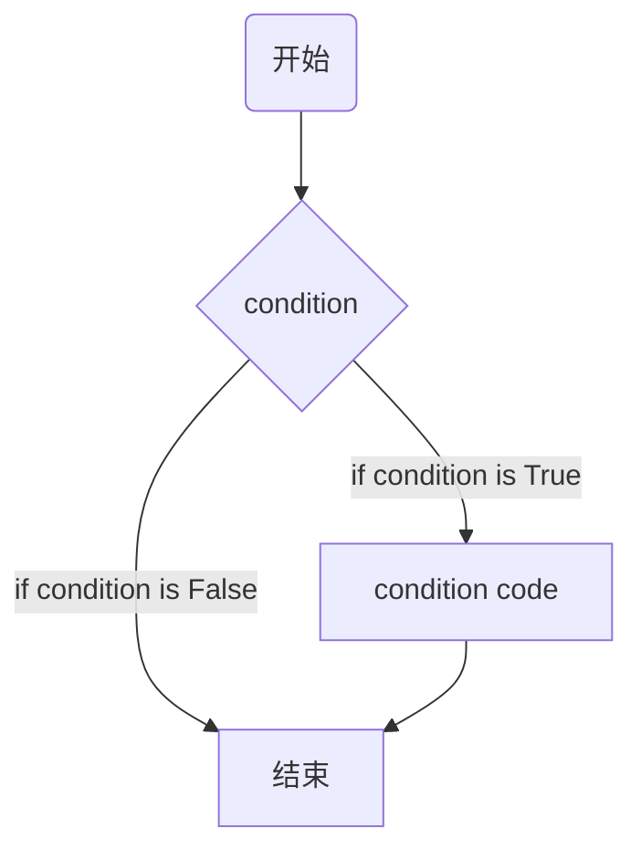

# Matlab基础入门

在MATLAB中使用分号`;`

分号`;`表示`结束语句`

> 如果要`抑制`和`隐藏表达式`的MATLAB`输出`，请在表达式后`添加`分号

##  添加注释
百分比符号`%`用于`指示注释行`
```matlab
x = 9    % assign the value 9 to x
```
MATLAB还可以使用`块注释运算符` **`%{`和`%}`** 编写 **一段注释** .

## 常用的运算符和特殊字符
|运算符|使用说明|
|:---:|:----:|
|`+`|相加; 加法运算符|
|`-`|相减; 减法运算符|
|`*`|标量和矩阵乘法运算符|
|`.*`|阵列乘法运算符|
|`^`|标量和矩阵求幂运算符|
|`.^`|阵列求幂运算符|
|`\`|左除法运算符|
|`/`|右除法运算符|
|`.\`|阵列左除法运算符|
|`./`|右除法运算符|
|`:`|冒号; 生成规则间隔的元素，并表示整个行或列|
|`( )`|括号; 包含函数参数和数组索引; 覆盖优先级|
|`[ ]`|括号; 罩住阵列元素|
|`.`|小数点|
|`…`|省略号; 行连续运算符|
|`,`|逗号; 分隔一行中的语句和元素|
|`;`|分号; 分隔列并抑制输出显示|
|`%`|百分号;指定一个注释并指定格式|
|`_`|引用符号和转置运算符|
|`._`|非共轭转置运算符|
|`=`|赋值运算符|


## 特殊变量和常数
|名称|含义|
|:---:|:----:|
|`ans`|最近的回应/回答|
|`eps`|浮点精度精度|
|`pi`|数字`π`|
|`Inf`|`∞`|
|`i`, `j`|虚构单位`√-1`|
|`.Nan`|未定义的数值结果,`非数字`|


## 保存工作
`save`命令用于在工作空间中`保存所有变量`，它在当前目录中，以`.mat`作为扩展名的文件。

```bash
save mymat
```
可以随时使用`load`命令重新加载文件
```bash
load mymat
```


## 变量历史
`who`命令显示使用过的`所有变量名`
```matlab
>> who

您的变量为:
ans  x    y
```

`whos`命令更多地显示变量
- 当前在内存中的变量
- 每个变量的类型
- 每个变量的内存分配
- 是否是复合的变量

执行结果如下
```matlab
>> whos
  Name      Size            Bytes  Class     Attributes

  ans       1x1                 8  double              
  x         1x1                 8  double              
  y         1x1                 8  double
```

`清除命令`从存储器中`删除所有(或指定的)变量`

```matlab
clear x     % it will delete x, won't display anything

clear       % it will delete all variables in the workspace
            % peacefully and unobtrusively
```

## 长任务


* **长任务**可以通过使用省略号 **`...` 扩展到另一行**

```matlab
initial_velocity = 0;
acceleration = 9.8;
time = 20;
final_velocity = initial_velocity ...
    + acceleration * time
```

等价于

```matlab
initial_velocity = 0;
acceleration = 9.8;
time = 20;
final_velocity = initial_velocity + acceleration * time
```


## 格式命令

默认情况下，MATLAB显示四位小数位数。这称为：**短格式**。但是，如果要更精确，则需要使用*`format`*命令。`format long`命令显示十进制后的**16位**数字。

```matlab
>> format long
>> x = 7 + 10/3 + 5 ^ 1.2

x =
	17.231981640639408
```

```matlab
>> format long
>> x = 7 + 10/3 + 5 ^ 1.2

x =
	17.2320
```

`format bank`命令将数字**舍入到小数点后两位**

```matlab
>> format bank
>> daily_wage = 177.45;
>> weekly_wage = daily_wage * 6

weekly_wage =
	1064.70
```

MATLAB使用**指数符号**显示大数字。
`format short e`命令*以指数形式显示四位小数加上指数*。

```matlab
>> format short e
>> 4.678 * 4.9

ans =
	2.2922e+01
```

`format long e`命令允许*以指数形式显示十六位小数加上指数*
```matlab
>> format long e
>> x = pi
x = 
	3.141592653589793e+00
```

`format rat`命令给出计算结果*最接近的合理表达式*

```matlab
>> format rat
>> 4.678 * 4.9

ans =
	2063/90
```

## 创建向量
+ 向量是数字的一维数组, MATLAB允许创建两种类型的向量：
	+ 行向量
	+ 列向量

+ **行向量**是通过用方括号中的元素集合来创建的，使用`空格`或`逗号`分隔元素

```matlab
>> a = [1, 2, 3, 4, 5, 6, 7, 8, 9]
>>  % 等价  a = [1 2 3 4 5 6 7 8 9]
a =
     1     2     3     4     5     6     7     8     9
```

> 计算相加
```matlab
>> r = [7  8  9 10 11];
>> t = [2, 3, 4, 5, 6];

>> result = r + t

result =
     9    11    13    15    17
```
+ **列向量**通过用方括号中的元素集合来创建，使用分号**`;`**来分隔元素
```matlab
>> c = [7;  8;  9;  10; 11]

c =
     7
     8
     9
    10
    11
```


## 创建矩阵

矩阵是数字的**二维数组**

在MATLAB中，通过将**每行**作为一系列` `或`,`分隔的元素输入矩阵，并以`;`分隔一行。

> 创建一个`3x3`的矩阵：

```maltab
>> m = [1 2 3; 4 5 6; 7 8 9]

m =
     1     2     3
     4     5     6
     7     8     9
```


## 管理会话的命令

|命令|描述说明|
|:---:|:---:|
|`clc`|清除命令窗口|
|`clear`|从内存中删除变量|
|`exist`|检查文件或变量是否存在|
|`global`|声明变量为全局变量|
|`help`|搜索帮助主题|
|`lookfor`|搜索帮助关键字的条目|
|`quit`|停止MATLAB|
|`who`|列出当前变量|
|`whos`|列出当前变量(长显示详细信息)|


## 使用系统命令

MATLAB提供了各种有用的命令来处理系统, 它还为其他系统相关活动提供各种命令

> 下表显示了一些*常用*的系统相关命令 

|   命令    |            描述说明            |
| :-------: | :----------------------------: |
|   `cd`    |   更改当前目录(进入指定目录)   |
|  `date`   |          显示当前日期          |
| `delete`  |            删除文件            |
|  `diary`  |     打开/关闭日记文件记录      |
|   `dir`   |    列出当前目录下的所有文件    |
|  `load`   |      从文件加载工作区变量      |
|  `path`   |          显示搜索路径          |
|   `pwd`   |          显示当前目录          |
|  `save`   |   将工作空间变量保存在文件中   |
|  `type`   |         显示文件的内容         |
|  `what`   | 列出当前目录中的所有MATLAB文件 |
| `wklread` |     读取`.wk1`电子表格文件     |

## 输入和输出命令

> MATLAB提供以下输入和输出相关命令 

|   命令    |           描述说明           |
| :-------: | :--------------------------: |
|  `disp`   |    显示数组或字符串的内容    |
| `fscanf`  |     从文件读取格式化数据     |
| `format`  |       控制屏幕显示格式       |
| `fprintf` | 对屏幕或文件执行格式化的写入 |
|  `input`  |      显示提示并等待输入      |
|    `;`    |         禁止打印显示         |


> `fscanf`和`fprintf`命令的行为类似于C语言中的`scanf`和`printf`函数。它们支持以下格式代码 

| 命令 |            描述说明            |
| :--: | :----------------------------: |
| `%s` |         格式化为字符串         |
| `%d` |      格式化为字符串整数值      |
| `%f` |         格式化为浮点值         |
| `%e` |   格式化为科学记数法的浮点值   |
| `%g` | 格式最紧凑的形式：`%f`或`%e`。 |
| `\n` |   在输出字符串中插入一个换行   |
| `\t` |    在输出字符串中插入制表符    |

>  格式化`format`函数具有以下用于数字显示的形式 

|       命令       |         描述说明         |
| :--------------: | :----------------------: |
|  `format short`  |    4位十进制数(默认)     |
|  `format long`   |         16位数字         |
| `format short e` |      5位数加上指数       |
| `format long e`  |       16位加上指数       |
|  `format bank`   |      两位十进制数字      |
|    `format +`    |        正，负或零        |
|   `format rat`   |         有理近似         |
| `format compact` |      禁止一些换行符      |
|  `format loose`  | 重置为较不紧凑的显示模式 |

## 向量，矩阵和数组命令

>  下表显示了用于处理数组，矩阵和向量的各种命令

|    命令    |         描述说明         |
| :--------: | :----------------------: |
|   `cat`    |         连接数组         |
|   `find`   |    查找非零元素的索引    |
|  `length`  |       计算元素数量       |
| `linspace` |    创建规则间隔的向量    |
| `logspace` |     创建对数间隔向量     |
|   `max`    |      返回最大的元素      |
|   `min`    |      返回最小的元素      |
|   `prod`   |        产生的每列        |
| `reshape`  |         改变大小         |
|   `size`   |       计算数组大小       |
|   `sort`   |      对每列进行排序      |
|   `sum`    |      对每列进行求和      |
|   `eye`    |     创建一个单位矩阵     |
|   `ones`   |       创建一个数组       |
|  `zeros`   |     创建一个零的数组     |
|  `cross`   |      计算矩阵交叉积      |
|   `dot`    |       计算矩阵点积       |
|   `det`    |     计算数组的行列式     |
|   `inv`    |      计算矩阵的倒数      |
|   `pinv`   |      计算矩阵的伪逆      |
|   `rank`   |       计算矩阵的秩       |
|   `rref`   |    计算简化行阶梯形式    |
|   `cell`   |      创建单元格数组      |
| `celldisp` |      显示单元格数组      |
| `cellplot` | 显示单元格阵列的图形表示 |
| `num2cell` |  将数组转换为单元格数组  |
|   `deal`   |    匹配输入和输出列表    |
|  `iscell`  |      识别单元格数组      |

## 绘图命令

>  MATLAB提供了许多用于绘制图形的命令。下表显示了一些常用的绘图命令

|    命令     |         描述说明         |
| :---------: | :----------------------: |
|   `axis`    |        设置轴限制        |
|   `fplot`   |       智能绘图功能       |
|   `grid`    |        显示网格线        |
|   `plot`    |      生成`xy`坐标图      |
|   `print`   |     打印或绘图到文件     |
|   `title`   |   在文字的顶部放置文字   |
|  `xlabel`   |  将文本标签添加到`x`轴   |
|  `ylabel`   |  将文本标签添加到`y`轴   |
|   `axes`    |        创建轴对象        |
|   `close`   |      关闭当前坐标图      |
| `close all` |      关闭所有坐标图      |
|  `figure`   |   打开一个新的图形窗口   |
|   `gtext`   |   通过鼠标启用标签放置   |
|   `hold`    |      冻结当前坐标图      |
|  `legend`   |     通过鼠标图例位置     |
|  `refresh`  |   重新绘制当前图形窗口   |
|    `set`    |  指定诸如轴的对象的属性  |
|  `subplot`  |     在子窗口中创建图     |
|   `text`    |     在图开放置字符串     |
|    `bar`    |        创建条形图        |
|  `loglog`   |      创建日志记录图      |
|   `polar`   |       创建极坐标图       |
| `semilogx`  | 创建半标记图(对数横坐标) |
| `semilogy`  | 创建半标记图(对数纵坐标) |
|  `stairs`   |        创建梯形图        |
|   `stem`    |         创建茎图         |

## .M文件

>  MATLAB允许编写两种程序文件

- **脚本** 
  -  脚本文件是以`.m`扩展名的程序文件
  - 在这些文件中，可以编写一系列要一起执行的命令
  - 脚本不接受输入，不返回任何输出
  - 它们对工作空间中的数据进行操作
- **函数** 
  - 函数文件也是扩展名为`.m`的程序文件。函数可以接受输入和返回输出
  - 内部变量是函数的局部变量

>  要创建脚本文件，需要使用文本编辑器。可以通过两种方式打开MATLAB编辑器：
> - 使用命令提示符
> - 使用IDE

1. 如果使用命令提示符，请在命令提示符下键入`edit`并回车，这将打开编辑器
2. 可以直接键入`edit`，然后直接输入文件名(扩展名为`.m`)

```matlab
edit 
%或者
edit newfile.m
```
上述命令将在默认的MATLAB目录中创建该文件。如果要将所有程序文件存储在`特定文件夹`中，则必须提供`整个路径`


在命令行中也可以**创建文件夹**，如：创建一个名为`worksplace`的文件夹。在命令提示符下键入以下命令`>>`

```matlab
mkdir worksplace    % create directory progs under default directory
chdir worksplace    % changing the current directory to progs
edit  worksplace.m  % creating an m file named prog1.m
```


如果使用IDE，请选择`新建 -> 脚本`。 这也打开编辑器并创建一个名为*Untitled*的文件。在输入代码后命名并保存文件。

在编辑器中键入以下代码 -

```matlab
NoOfStudents = 6000;
TeachingStaff = 150;
NonTeachingStaff = 20;
Total = NoOfStudents + TeachingStaff ... 
		+ NonTeachingStaff;
disp(Total);
```

创建并保存文件后，可以通过两种方式运行

- 单击编辑器窗口上的`运行`按钮
- 只需在命令提示符下键入文件名(无扩展名)即可：*>> worksplace*


## MATLAB数据类型

MATLAB提供`15`种*基本数据类型*。每种数据类型存储*矩阵*或*数组*形式的数据。矩阵或数组的最小值是`0`到`0`，并且是可以到任何大小的矩阵或数组

>下表显示了MATLAB中最常用的数据类型

|  数据类型  |       描述       |
| :--------: | :------------------------------------: |
|   `int8`   |                       `8`位有符号整数                        |
|  `uint8`   |                       `8`位无符号整数                        |
|  `int16`   |                       `16`位有符号整数                       |
|  `uint16`  |                       `16`位无符号整数                       |
|  `int32`   |                       `32`位有符号整数                       |
|  `uint32`  |                       `32`位无符号整数                       |
|  `int64`   |                       `64`位有符号整数                       |
|  `uint64`  |                       `64`位无符号整数                       |
|  `single`  |                        单精度数值数据                        |
|  `double`  |                        双精度数值数据                        |
| `logical`  |          逻辑值为`1`或`0`，分别代表`true`和`false`           |
|   `char`   |               字符数据(字符串作为**字符向量**存储)               |
| 单元格阵列 |     索引单元阵列，每个都能够存储不同维数和数据类型的数组     |
|   结构体   | C型结构，每个结构具有能够存储不同维数和数据类型的数组的命名字段 |
|  函数处理  |                      指向一个函数的指针                      |
|   用户类   |                    用户定义的类构造的对象                    |
|   Java类   |                      从Java类构造的对象                      |

> 示例

```matlab
>> str = 'Hello World!'
>> n = 2345
>> d = double(n)
>> un = uint32(789.50)
>> rn = 5678.92347
>> c = int32(rn)


str =
    'Hello World!'

n =
        2345

d =
        2345

un =
  uint32
   790

rn =
   5.6789e+03

c =
  int32
   5679
```

## 数据类型转换

>  MATLAB提供了各种用于将一种数据类型转换为另一种数据类型的函数

|       函数       |                    描述说明                    |
| :--------------: | :--------------------------------------------: |
|      `char`      |             转换为字符数组(字符串)             |
|    `int2str`     |             将整数数据转换为字符串             |
|    `mat2str`     |               将矩阵转换为字符串               |
|    `num2str`     |               将数字转换为字符串               |
|   `str2double`   |             将字符串转换为双精度值             |
|    `str2num`     |               将字符串转换为数字               |
| `native2unicode` |          将数字字节转换为Unicode字符           |
| `unicode2native` |          将Unicode字符转换为数字字节           |
|    `base2dec`    |          将基数N字符串转换为十进制数           |
|    `bin2dec`     |          将二进制数字串转换为十进制数          |
|    `dec2base`    |         将十进制转换为字符串中的N数字          |
|    `dec2bin`     |        将十进制转换为字符串中的二进制数        |
|    `dec2hex`     |           将十进制转换为十六进制数字           |
|    `hex2dec`     |       将十六进制数字字符串转换为十进制数       |
|    `hex2num`     |      将十六进制数字字符串转换为双精度数字      |
|    `num2hex`     |         将单数转换为IEEE十六进制字符串         |
|    `cell2mat`    |             将单元格数组转换为数组             |
|  `cell2struct`   |           将单元格数组转换为结构数组           |
|    `cellstr`     |            从字符数组创建字符串数组            |
|    `mat2cell`    | 将数组转换为具有潜在不同大小的单元格的单元阵列 |
|    `num2cell`    |   将数组转换为具有一致大小的单元格的单元阵列   |
|  `struct2cell`   |             将结构转换为单元格数组             |

## 数据类型确定

> MATLAB提供了用于识别变量数据类型的各种函数。

|         函数         |             描述说明             |
| :------------------: | :------------------------------: |
|         `is`         |             检测状态             |
|        `isa`         |    确定输入是否是指定类的对象    |
|       `iscell`       |       确定输入是单元格数组       |
|     `iscellstr`      |   确定输入是字符串的单元格数组   |
|       `ischar`       |      确定项目是否是字符数组      |
|      `isfield`       |    确定输入是否是结构数组字段    |
|      `isfloat`       |      确定输入是否为浮点数组      |
|     `ishghandle`     |   确定是否用于处理图形对象句柄   |
|     `isinteger`      |      确定输入是否为整数数组      |
|       `isjava`       |      确定输入是否为Java对象      |
|     `islogical`      |      确定输入是否为逻辑数组      |
|     `isnumeric`      |      确定输入是否是数字数组      |
|      `isobject`      |     确定输入是否为MATLAB对象     |
|       `isreal`       |      检查输入是否为实数数组      |
|      `isscalar`      |        确定输入是否为标量        |
|       `isstr`        |      确定输入是否是字符数组      |
|      `isstruct`      |      确定输入是否是结构数组      |
|      `isvector`      |        确定输入是否为向量        |
|       `class`        |           确定对象的类           |
| `validateattributes` |         检查数组的有效性         |
|        `whos`        | 在工作区中列出变量，其大小和类型 |

### 示例

使用以下代码创建脚本文件

```matlab
x = 3
isinteger(x)
isfloat(x)
isvector(x)
isscalar(x)
isnumeric(x)

x = 23.54
isinteger(x)
isfloat(x)
isvector(x)
isscalar(x)
isnumeric(x)

x = [1 2 3]
isinteger(x)
isfloat(x)
isvector(x)
isscalar(x)

x = 'Hello'
isinteger(x)
isfloat(x)
isvector(x)
isscalar(x)
isnumeric(x)
```

> result is

```matlab
x = 3
ans = 0
ans = 1
ans = 1
ans = 1
ans = 1

x = 23.5400
ans = 0
ans = 1
ans = 1
ans = 1
ans = 1

x =
          1          2          3
ans = 0
ans = 1
ans = 1
ans = 0

x = 'Hello'
ans = 0
ans = 0
ans = 1
ans = 0
ans = 0
```


> MATLAB中的运算符`既可用于标量数据也可用于非标量数据`

MATLAB允许以下类型的基本操作

- 算术运算符
- 关系运算符
- 逻辑运算符
- 按位运算符
- 集合运算符

## 算术运算符

MATLAB允许两种不同类型的算术运算

- 矩阵算术运算
- 数组算术运算


+ 矩阵算术运算与线性代数中定义的相同
+ 在一维和多维数组中，逐个元素执行数组运算
+ 矩阵运算符和数组运算符由句点符号**`.`**区分

> 然而，由于对于矩阵和阵列的加减运算是相同的，因此对于这两种情况，运算符相同


| 运算符 |                           描述说明                           |
| :----: | :----------------------------------------------------------: |
|  `+`   | 加法或一元加法运算。`A + B`表示相加存储在变量`A`和`B`中的值。`A`和`B`必须具有**相同**的大小，除非是标量。 标量可以添加到任何大小的矩阵。 |
|  `-`   | 减法或一元减法运算。 `A-B`表示从`A`中减去`B`的值。`A`和`B`必须具有相同的大小，除非是标量。可以从任何大小的矩阵中减去标量。 |
|  `*`   | 矩阵乘法。 `C = A * B`是矩阵`A`和`B`的线性代数乘积。更准确地说，执行公式：$$C\left( i,j\right) =\sum ^{n}_{k=1}A\left( i,k\right) B\left( k,j\right)$$，对于非标量`A`和`B`，`A`的列数必须等于`B`的行数。标量可以乘以任何大小的矩阵。 |
|  `.*`  | 阵列乘法。 `A .* B`是数组`A`和`B`的逐个元素乘积。`A`和`B`必须具有相同的大小，除非它们之一是标量。 |
|  `/`   | 数组乘法。`A .* B`是数组`A`和`B`的逐个元素乘积。`A`和`B`必须具有相同的大小，除非它们之一是标量。 |
|  `./`  | 数组右除。`A./B`是具有元素`A(i，j)/ B(i，j)`的矩阵。 `A`和`B`必须具有相同的大小，除非它们之一是标量。 |
|  `\`   | 反斜杠或数组左除。如果`A`是一个方阵，`A \ B`与`inv(A)* B`大致相同，除了以不同的方式计算。如果`A`是`n×n`矩阵，`B`是具有`n`个分量的列向量或具有若干这样的列的矩阵，则`X = A \ B`是方程`AX = B`的解。如果A是不规则或几乎单数，将显示警告消息。 |
|  `.\`  | 阵列左除。`A .\ B`是具有元素`B(i，j)/ A(i，j)`的矩阵。`A`和`B`必须具有相同的大小，除非它们之一是标量。 |
|  `^`   | 矩阵 `X ^ p`是`X`的`P`次幂，如果`p`是标量。 如果`p`是整数，则通过重复平方来计算幂值。 如果整数为负，则`X`首先倒置。 对于`p`的其他值，计算涉及特征值和特征向量，使得如果`[V，D] = eig(X)`，则`X ^ p = V * D. ^ p / V`。 |
|  `.^`  | 阵列幂值， `A ^ B`是`B(i，j)`到`A(i，j)`的幂矩阵。`A`和`B`必须具有相同的大小，除非它们之一是标量。 |
|  `'`   | 矩阵转置。 `'`是`A`的线性代数转置。对于复数矩阵，这是复共轭转置。 |
|  `.'`  | 数组转置。`.'`是`A`的数组转置。对于复数矩阵，这不涉及共轭。  |

### 示例

>  以下示例显示了算术运算符对*标量数据*的使用。使用以下代码创建脚本文件

```matlab
a = 10;
b = 20;
c = a + b
d = a - b
e = a * b
f = a / b
g = a \ b
x = 7;
y = 3;
z = x ^ y
```

>  运行文件时，会产生以下结果

```shell
c =  30
d = -10
e =  200
f =  0.50000
g =  2
z =  343
```


## 关系运算符

关系运算符也可以用于*标量*和*非标量数据*。数组的关系运算符在两个数组之间执行逐个元素的比较，并返回相同大小的逻辑数组，如果为真，则元素设置为逻辑`1(true)`，如果为假，则元素设置为逻辑`0(false)`。

| 操作符 |  说明描述  |
| :----: | :--------: |
|  `<`   |    小于    |
|  `<=`  | 小于或等于 |
|  `>`   |    大于    |
|  `>=`  | 大于或等于 |
|  `==`  |    等于    |
|  `~=`  |   不等于   |

```matlab
a = 100;
b = 200;
if (a >= b)
	max = a
else
	max = b
end
```

> result is:

```matlab
max =  200
```

除了上述关系运算符之外，MATLAB还提供以下用于相同目的的**函数**

|    函数    |              描述               |
| :--------: | :-----------------------------: |
| `eq(a, b)` |       测试`a`是否等于`b`        |
| `ge(a, b)` |    测试`a`是否大于或等于`b`     |
| `gt(a, b)` |       测试`a`是否大于`b`        |
| `le(a, b)` |    测试`a`是否小于或等于`b`     |
| `lt(a, b)` |       测试`a`是否小于`b`        |
| `ne(a, b)` |      测试`a`是否不等于`b`       |
| `isequal`  |      测试数组以获得相等性       |
| `isequaln` | 测试数组相等，将`NaN`值视为相等 |

```matlab
% comparing two values
a = 100;
b = 200;
if (ge(a,b))
  max = a
else
  max = b
end

% comparing two different values
a = 340;
b = 520;
if (le(a, b))
  disp(' a is either less than or equal to b')
else
  disp(' a is greater than b')
end
```

> result is

```matlab
max =  200
 a is either less than or equal to b
```


## 逻辑运算符

MATLAB提供两种类型的逻辑运算符和函数：

- 逐元素 - 这些运算符对逻辑阵列的相应元素进行操作。
- 短路 - 这些运算符在标量和逻辑表达式上运行。

元素逻辑运算符在逻辑数组上运行逐个元素。符号`＆`，`|`和`〜`是逻辑数组运算符`AND`，`OR`和`NOT`。

短路逻辑运算符允许逻辑运算短路。符号`&&`和`||`是逻辑短路运算符`AND`和`OR`

```matlab
a = 5;
b = 20;
if ( a && b )
  disp('Line 1 - Condition is true');
end
if ( a || b )
  disp('Line 2 - Condition is true');
end

% lets change the value of  a and b 
a = 0;
b = 10;
if ( a && b )
  disp('Line 3 - Condition is true');
else
  disp('Line 3 - Condition is not true');
end

if (~(a && b))
  disp('Line 4 - Condition is true');
end
```

```shell
Line 1 - Condition is true
Line 2 - Condition is true
Line 3 - Condition is not true
Line 4 - Condition is true
```

## 位运算

按位运算符对位执行，并执行逐位运算。`＆`，`|`和`^`的真值表如下
|`p`|`q`|`p&q`|`p|q`|`p^q`|
|:--:|:--:|:--:|:---:|:--:|
|0|0|0|0|0|
|0|1|0|1|1|
|1|1|1|1|0|
|1|0|0|1|1|

假设`A = 60`和`B = 13`

 现在以二进制格式，它们将如下所示：

```shell
A = 0011 1100

B = 0000 1101

-----------------

A&B = 0000 1100

A|B = 0011 1101

A^B = 0011 0001

~A  = 1100 0011
```

MATLAB提供了诸如`按位与`和`按位或`以及`按位非`操作，移位操作等位操作的各种功能。

下表显示了常用的按位操作：

|      方法      |                             目的                   |
| :------------: | :----------------------------------------------------------: |
| ` bitand(a, b)`  |                 整数`a`和`b`的位与`AND`操作       |
|   `bitcmp(a) `   |                        `a`的比特补码              |
| `bitget(a,pos)`  |          在整数数组`a`中，获取指定的位置`pos`位字节   |
|  `bitor(a, b)`   |                  整数`a`和`b`的逐位`OR`操作        |
| `bitset(a, pos)` |                  设置在指定`pos`处的位字节         |
| `bitshift(a, k)` | 返回向左移位`k`字节，相当于乘以`2^k`。 `k`的负值对应于向右移位或除以`2^k,`并舍入到最接近的整数到负无穷大。任何溢出位都被截断  |
|  `bitxor(a, b)`  |               整数`a`和`b`的逐字节位`XOR`操作      |
|  ` swapbytes `   |                         交换字节排序              |

```matlab
a = 60; % 60 = 0011 1100   
b = 13; % 13 = 0000 1101 
c = bitand(a, b)      % 12 = 0000 1100  
c = bitor(a, b)       % 61 = 0011 1101 
c = bitxor(a, b)      % 49 = 0011 0001 
c = bitshift(a, 2)    % 240 = 1111 0000 
c = bitshift(a,-2)    % 15 = 0000 1111
```

> result is

```shell
c =  12
c =  61
c =  49
c =  240
c =  15
```

## 集合操作

MATLAB为集合操作提供了各种功能，如*联合*，*交集*和*集合*成员的测试等。

|         函数          |                             描述                             |
| :-------------------: | :----------------------------------------------------------: |
|   `intersect(A,B)`     | 设置两个阵列的交集; 也就是返回`A`和`B`共同的值。返回的值按排序顺序排列。 |
| `intersect(A,B,’rows’)` | 将`A`的每一行和`B`的每一行视为单个实体，并返回`A`和`B`两者共同的行。返回矩阵的行按排序顺序排列。 |
|     `ismember(A,B)`     | 返回与`A`相同大小的数组，其中包含`1(true)`，其中`A`的元素位于`B`中。其他地方返回`0(false)`。 |
| `ismember(A,B,’rows’)`  | 将`A`的每行和`B`的每一行视为单个实体，并返回一个包含`1(true)`的向量，其中矩阵`A`的行也是`B`行。其他返回`0(false)`。 |
|      `issorted(A)`      | 如果`A`的元素按排序顺序返回逻辑`1`(真)，否则返回逻辑`0`(假)。输入`A`可以是一个向量，也可以是`N-by-1`或`1-by-N`的字符串数组。 如果`A`和`sort(A)`的输出相等，则认为`A`被排序。 |
|  `issorted(A, ‘rows’)`  | 如果二维矩阵`A`的行按排序顺序返回逻辑`1`(真)，否则返回逻辑`0`(假)。 如果`A`和排序`(A)`的输出相等，则认为矩阵`A`被排序。 |
|     `setdiff(A,B)`      | 设置两个数组的差异; 返回`A`中不在`B`中的值。返回的数组中的值按排序顺序排列。 |
|  `setdiff(A,B,’rows’)`  | 将`A`的每一行和`B`的每一行视为单个实体，并从不在`B`中的`A`返回行。返回的矩阵的行按排序顺序排列。`'rows'`选项不支持单元格数组。 |
|        `setxor`         |                      设置两个数组的异或                      |
|         `union`         |                      设置两个数组的并集                      |
|        `unique`         |                       使数组中的值唯一                       |


## MATLAB提供以下类型的决策语句

|                             语句                             |                             描述                             |
| :----------------------------------------------------------: | :----------------------------------------------------------: |
| `if…end` |   `if ... end`语句包含一个布尔表达式，后跟一个或多个语句。   |
| `if…else…end` | `if`语句可以跟随一个可选的`else`语句，当布尔表达式为`false`时，`else`语句块将执行。 |
| `if…elseif…elseif…else…end` | `if`语句后面可以有一个(或多个)可选`elseif ...`和一个`else`语句，这对于测试各种条件非常有用。 |
| `嵌套if语句` | 可以在一个`if`或`elseif`语句中使用另一个`if`或`elseif`语句。 |
| `switch`|        `switch`语句用来测试一个变量与值列表的相等性。        |
| `嵌套switch语句` |        可以在一个`switch`语句中使用一个`switch`语句。        |

## if…end语法


在MATLAB中，`if`语句的语法


```matlab
if <expression>
	% statement(s) will execute if the boolean expression is true 
	<statements>
end
```


如果表达式`expression`计算结果为`true`，则`if`语句中的代码块将被执行。如果表达式的计算结果为`false`，那么执行结束语句后的第一组代码

> e.g.

```matlab
a = 10;
% check the condition using if statement 
   if a < 20 
   % if condition is true then print the following 
      fprintf('a is less than 20\n' );
   end
fprintf('value of a is : %d\n', a);
```

执行上面示例代码，得到以下结果

```shell
a is less than 20
value of a is : 10
```

## if…else…end语法

MATLAB中`if...else`语句的语法

```matlab
if <expression>
	% statement(s) will execute if the boolean expression is true 
	<statement(s)>
else
	<statement(s)>
	% statement(s) will execute if the boolean expression is false 
end
```

> 如果布尔表达式`expression`的值为`true`，那么`if`代码块将被执行，否则`else`代码块将被执行


> e.g.

```matlab
a = 100;
% check the boolean condition 
if a < 20 
  % if condition is true then print the following 
  fprintf('a is less than 20\n' );
else
  % if condition is false then print the following 
  fprintf('a is not less than 20\n' );
end
  fprintf('value of a is : %d\n', a);
```

执行上面示例代码，得到以下结果

```shell
a is not less than 20
value of a is : 100
```


## if…elseif…elseif…else…end语法

- `if`可以有零个或一个`else`，它必须在`elseif`之后。
- `if`可以有零到多个`elseif`，它们必须在`else`语句之前。
- 当有一个`else if`匹配成功，其余的`elseif`和`else`都不会被测试。

**语法**

```matlab
if <expression 1>
	% Executes when the expression 1 is true 
	<statement(s)>
elseif <expression 2>
	% Executes when the boolean expression 2 is true
	<statement(s)>
elseif <expression 3>
	% Executes when the boolean expression 3 is true 
	<statement(s)>
else 
	%  executes when the none of the above condition is true 
	<statement(s)>
end
```

> e.g.

创建脚本文件并在其中键入以下代码 

```matlab
a = 100;

%check the boolean condition 
if a == 10 
	% if condition is true then print the following 
	fprintf('Value of a is 10\n' );
elseif( a == 20 )
	% if else if condition is true 
	fprintf('Value of a is 20\n' );
elseif a == 30 
	% if else if condition is true  
	fprintf('Value of a is 30\n' );
else
	% if none of the conditions is true '
	fprintf('None of the values are matching\n');
	fprintf('Exact value of a is: %d\n', a );
end
```

当上述代码被编译和执行时，它产生以下结果

```matlab
None of the values are matching
Exact value of a is: 100
```

## 嵌套if语句语法

嵌套`if`语句的语法如下 

```matlab
if <expression 1>
	% Executes when the boolean expression 1 is true 
   if <expression 2>
      % Executes when the boolean expression 2 is true    
  end
end
```

可以使用与嵌套`if`语句相似的方式来嵌套`elseif...`语句块。

> e.g,

创建脚本文件并在其中键入以下代码

```matlab
a = 100;
b = 200;
% check the boolean condition 
if( a == 100 )
    % if condition is true then check the following 
    if( b == 200 )
        % if condition is true then print the following 
        fprintf('Value of a is 100 and b is 200\n' );
    end
end
fprintf('Exact value of a is : %d\n', a );
fprintf('Exact value of b is : %d\n', b );
```

执行上面示例代码，得到以下结果 -

```shell
Value of a is 100 and b is 200
Exact value of a is : 100
Exact value of b is : 200
```

## switch语法

`switch`块有条件地执行来自多个选择的一组语句。每个选择由`case`语句指定。

评估的`switch_expression`是一个标量或字符串。

评估的`case_expression`是标量，标量或字符串的字符串或单元格数组。

`switch`块测试每种情况，直到其中一种情况为真(`true`)。

以下情况是真的 

- 对于数字，`eq(case_expression，switch_expression)`。
- 对于字符串，`strcmp(case_expression，switch_expression)`。
- 对于对象，支持`eq(case_expression，switch_expression)`。
- 对于单元格数组`case_expression`至少有一个。

当情况`case`为真时，MATLAB会执行相应的语句，然后退出`switch`块。

`otherwise`块是可选的，并且仅在没有`case`为真时执行。

**语法**

MATLAB中`switch`语句的语法

```matlab
switch <switch_expression>
   case <case_expression>
      <statements>
   case <case_expression>
      <statements>
      ...
      ...
   otherwise
      <statements>
end
```

> e.g.

创建脚本文件并在其中键入以下代码

```matlab
grade = 'B';
switch(grade)
    case 'A' 
        fprintf('Excellent!\n' );
    case 'B' 
        fprintf('Well done\n' );
    case 'C' 
        fprintf('Well done\n' );
    case 'D'
        fprintf('You passed\n' );
    case 'F' 
        fprintf('Better try again\n' );
    otherwise
        fprintf('Invalid grade\n' );
end
```

执行上面示例代码，得到以下结果

```shell
Well done
```

## 嵌套switch语句语法

可以将一个`switch`作为外部`switch`语句序列的一部分。即使内部和外部`switch`的`case`常数包含公共值，也不会产生任何冲突。

**语法**

嵌套`switch`语句的语法如下

```matlab
switch(ch1) 
   case 'A' 
   fprintf('This A is part of outer switch');
      switch(ch2) 
         case 'A'
         fprintf('This A is part of inner switch' );
         case 'B'  
         fprintf('This B is part of inner switch' );
      end
   case 'B'
   fprintf('This B is part of outer switch' );
end
```

> e.g.

创建脚本文件并在其中键入以下代码

```matlab
a = 100;
b = 200;
switch(a) 
   case 100 
   fprintf('This is part of outer switch %d\n', a );
   switch(b) 
      case 200
      fprintf('This is part of inner switch %d\n', a );
   end
end
fprintf('Exact value of a is : %d\n', a );
fprintf('Exact value of b is : %d\n', b );
MATLAB
```

执行上面示例代码，得到以下结果

```shell
This is part of outer switch 100
This is part of inner switch 100
Exact value of a is : 100
Exact value of b is : 200
```

## 循环

MATLAB提供以下类型的循环来处理循环需求。

|          循环类型    |        描述       |
| :-------------------: | :------------: |
| `while循环` | 在给定条件为真时，重复一个语句或一组语句。它在执行循环体之前测试状态。 |
| `for循环`|        多次执行一系列语句，并缩写管理循环变量的代码。        |
| `嵌套循环` |             在任何循环中使用另外一个或多个循环。             |

## 循环控制语句

循环控制语句从其正常顺序更改执行。当执行离开范围时，在该范围内创建的所有自动对象都将被销毁。

MATLAB支持以下控制语句。

|            控制语句    |         描述           |
| :----------: | :-----------: |
| `break语句`|         终止循环语句，并将执行转移到循环之后的语句。         |
| `continue语句`| 导致循环跳过主体的剩余部分，并在重申之前立即重新测试其状态。 |


## while循环语法

`while`循环在条件为`真true`时重复执行语句。

MATLAB中`while`循环的语法

```matlab
while <expression>
	<statements>
end
```

只要表达式(`expression`)为`true`，`while`循环将重复执行程序语句`statements`

当结果为*非空*并且*包含所有非零元素(逻辑或实数)*时，表达式`expression`为`true`;  否则，表达式`expression`为`false`。

> e.g.

```matlab
a = 10;
% while loop execution 
while( a < 20 )
  fprintf('value of a: %d\n', a);
  a = a + 1;
end
```

执行上面示例代码，得到以下结果 -

```shell
value of a: 10
value of a: 11
value of a: 12
value of a: 13
value of a: 14
value of a: 15
value of a: 16
value of a: 17
value of a: 18
value of a: 19
```


## for循环语法

`for`循环是一种重复控制结构，可以让您有效地编写一个需要执行特定次数的循环。

MATLAB中`for`循环的语法

```matlab
for index = values
   <program statements>
     ...
end
```

值`values`具有以下格式:

|        值格式         |                             描述                             |
| :-------------------: | :----------------------------------------------------------: |
|   `initval:endval`    | `index`变量从`initval`到`endval`每次递增`1`，并重复程序语句的执行，直到`index`大于`endval` |
| `initval:step:endval` | 通过每次迭代值步长`step`加索引`index`的值，或者当`step`为**负时递减** |
|      `valArray`       | 在每个迭代中从数组`valArray`的后续列创建列向量索引。 例如，在第一次迭代中，`index = valArray(:，1)`。 循环最多执行`n`次，其中`n`是由`numel(valArray，1，:)`给出的`valArray`的列数。`valArray`可以是任何MATLAB数据类型，包括字符串，单元格数组或结构体 |


> e.g. first
```matlab
for a = 10:20 
   fprintf('value of a: %d\n', a);
end
```
> result is
```shell
value of a: 10
value of a: 11
value of a: 12
value of a: 13
value of a: 14
value of a: 15
value of a: 16
value of a: 17
value of a: 18
value of a: 19
value of a: 20
Shell
```

> e.g. second

```matlab
for a = 1.0: -0.1: 0.0
   disp(a)
end
```

> result is
```shell
 1
 0.90000
 0.80000
 0.70000
 0.60000
 0.50000
 0.40000
 0.30000
 0.20000
 0.10000
0
```

> e.g. three

```matlab
for a = [24,18,17,23,28]
   disp(a)
end
```

> result is
```shell
24
18
17
23
28
```


## 循环嵌套语法

MATLAB中`嵌套for`循环语句的语法如下：

```matlab
for m = 1:j
   for n = 1:k
      <statements>;
   end
end
```

MATLAB中的嵌套`while`循环语句的语法如下：

```matlab
while <expression1>
   while <expression2>
      <statements>
   end
end
```

> e.g.

让使用一个嵌套的`for`循环来显示从`1`到`100`的所有素数

```matlab
for i=2:100
   for j=2:100
      if(~mod(i,j)) 
         break; % if factor found, not prime
      end 
   end
   if(j > (i/j))
      fprintf('%d 是一个素数\n', i);
   end
end
```

>  执行以上示例代码，得到以下结果

```shell
2 是一个素数
3 是一个素数
5 是一个素数
7 是一个素数
11 是一个素数
13 是一个素数
17 是一个素数
19 是一个素数
23 是一个素数
29 是一个素数
31 是一个素数
37 是一个素数
41 是一个素数
43 是一个素数
47 是一个素数
53 是一个素数
59 是一个素数
61 是一个素数
67 是一个素数
71 是一个素数
73 是一个素数
79 是一个素数
83 是一个素数
89 是一个素数
97 是一个素数
```


## break语句

`break`语句用来终止`for`或`while`循环的执行。 在循环中`break`语句之后出现的语句不执行。

在嵌套循环中，`break`仅从它所在的循环中退出。控制传递到该循环结束后的语句。

> e.g.

```matlab
a = 10;
% while loop execution 
while (a < 20 )
   fprintf('value of a: %d\n', a);
   a = a+1;
      if( a > 15)
         % terminate the loop using break statement 
         break;
      end 
end
MATLAB
```

>  执行上面示例代码，得到以下输出结果

```shell
value of a: 10
value of a: 11
value of a: 12
value of a: 13
value of a: 14
value of a: 15
```

## continue语句

`continue`语句用于将控件传递给`for`循环或`while`循环的下一个迭代。

在MATLAB中的`continue`语句有点像`break`语句。 然而，`“continue”`**不是强制**终止，而是迫使循环的**下一次迭代发生**，跳过其间的任何代码。

>  e.g.

```matlab
a = 9;
%while loop execution 
while a < 20
   a = a + 1; 
   if a == 15
      % skip the iteration 
      continue;
   end 
fprintf('value of a: %d\n', a);
end
```

>  执行上面示例代码，得到以下结果

```shell
value of a: 10
value of a: 11
value of a: 12
value of a: 13
value of a: 14
value of a: 16
value of a: 17
value of a: 18
value of a: 19
value of a: 20
```


### 创建向量
+ 向量是数字的一维数组, MATLAB允许创建两种类型的向量：
	+ 行向量
	+ 列向量

+ **行向量**是通过用方括号中的元素集合来创建的，使用`空格`或`逗号`分隔元素

```matlab
>> a = [1, 2, 3, 4, 5, 6, 7, 8, 9]
>>  % 等价  a = [1 2 3 4 5 6 7 8 9]
a =
     1     2     3     4     5     6     7     8     9
```


+ **列向量**通过用方括号中的元素集合来创建，使用分号**`;`**来分隔元素
```matlab
>> c = [7;  8;  9;  10; 11]

c =
     7
     8
     9
    10
    11
```

### 引用向量的元素

> 可以通过多种方式来引用一个或多个向量的元素。向量`v`的第`i`个分量叫作`v(i)`

```matlab
>> v = [ 1; 2; 3; 4; 5; 6];    % creating a column vector of 6 elements
>> v(3)

ans =
     3
```

> 引用带冒号的向量(如`v(:)`)时，将列出向量的所有组件

```matlab
>> v = [ 1; 2; 3; 4; 5; 6];    % creating a column vector of 6 elements
>> v(:)

ans =
     1
     2
     3
     4
     5
     6
```

> MATLAB可从向量中**选择一系列元素**。

创建一个`9`个元素的行向量`rv`，然后通过`rv(3:7)`引用`3`到`7`元素，然后引用来向一个新创建的`sub_rv`向量赋值:

```matlab
>> rv = [1 2 3 4 5 6 7 8 9];
>> sub_rv = rv(3:7)

sub_rv =
     3     4     5     6     7
```

## 向量运算

- 向量的加减
- 向量的标量乘法
- 转置向量
- 附加向量
- 向量的幅值大小
- 向量点积
- 具有均匀间隔元素的向量


### 向量的加减

可以**添加**或**减少**两个向量。这两个操作的向量必须是*相同的类型*并且具有*相同数量*的元素

> for example

```matlab
A = [7, 11, 15, 23, 9];
B = [2, 5, 13, 16, 20];
C = A + B;
D = A - B;
disp(C);
disp(D);
```
> result is 

```shell
9    16    28    39    29
5     6     2     7   -11
```

### 向量的标量乘法

将一个向量乘以一个数字时，这称为**标量乘法**。标量乘法产生相同类型的新向量，原始向量的每个元素乘以数字。

> for example
```matlab
v = [ 12 34 10 8];
m = 5 * v
```

> result is 
```bash
m =
    60   170    50    40
```
> 请注意，可以对向量执行**所有标量运算**
> 	例如:标量数量对向量执行相加，相减和除法运算

### 转置向量

`转置操作`是将`列向量`更改为`行向量`，反之亦然。 转置操作由单引号`'`表示

> for example

```matlab
r = [ 1 2 3 4 ];
tr = r';
v = [1;2;3;4];
tv = v';
disp(tr); 
disp(tv);
```
> result is 

```bash
 	 1
     2
     3
     4

     1     2     3     4
```

### 附加向量

MATLAB允许*将多个向量* **附加**在一起来创建新的向量。

假设，如果有两个具有`n`和`m`个元素的**行**向量`r1`和`r2`，通过附加这两个向量来创建`n*m`个元素的行向量`r` 

```matlab
r = [r1;r2]
```

然而，要做到这一点，这两个向量应该具有**相同数量**的元素。

类似地，可以附加两个**列**向量`c1`和`c2`，其中分别具有`n`和`m`个元素。要创建`n`加`m`个元素的列向量`c`，通过附加这些向量，可以这样书写 

```matlab
c = [c1; c2]
```

还可以通过附加这两个向量来创建矩阵`c`; 向量`c2`将是矩阵的第二列 

```matlab
c = [c1, c2]
```

要做到这一点，这两个向量应该具有**相同数量**的元素。

>  for exapmle


```matlab
r1 = [ 1 2 3 4 ];
r2 = [5 6 7 8 ];
r = [r1,r2]
rMat = [r1;r2]

c1 = [ 1; 2; 3; 4 ];
c2 = [5; 6; 7; 8 ];
c = [c1; c2]
cMat = [c1,c2]
```

>运行文件时，会显示以下结果

```shell
r =
 Columns 1 through 7:

          1          2          3          4          5          6          7
 Column 8:

          8

rMat =
          1          2          3          4
          5          6          7          8

c =

          1
          2
          3
          4
          5
          6
          7
          8

cMat =

          1          5
          2          6
          3          7
          4          8
```

### 向量的幅值大小

具有元素为`v1`，`v2`，`v3`，`...`，`vn`的向量`v`的幅值(大小)由下列公式求出：

$$
\left| v\right| =\sqrt {v^{2}_{1}+v^{2}_{2}+v^{2}_{3}+\ldots +v^{2}_{n}}
$$

采取以下步骤来计算向量的大小

- 以向量的**乘积**为单位，使用数组乘法`.*`. 产生向量`sv`，向量`sv`的元素是向量`v`的元素的平方
  - 即：`sv = v .* v;`
- 使用`sum`函数得到向量`v`的元素的平方和，也称为向量`v`的点积
  - 即：`dp= sum(sv);`
- 使用`sqrt`函数得到和的平方根，也是向量`v`的大小。
  - 即：`mag = sqrt(s);`

> for example
>
```matlab
v = [1: 2: 10];
sv = v.* v      %the vector with elements 
                 % as square of v's elements
dp = sum(sv)    % sum of squares -- the dot product
mag = sqrt(dp)  % magnitude
```

> result is 

```bash
sv = 
	1	9	25	49	81

dp = 
	165
	
mag = 
	12.8452
```


### 向量点积

两个向量`a =(a1，a2，...，an)`和`b =(b1，b2，...，bn)`的**点积**由下公式计算给出：

```matlab
a.b = ∑(ai.bi)
```

使用`dot`函数计算两个向量`a`和`b`的点积。

```matlab
dot(a, b);
```

> for example

```matlab
v1 = [2 3 4];
v2 = [1 2 3];
dp = dot(v1, v2);
disp('Dot Product:');
disp(dp);
```

> result is 

```shell
Dot Product:
   20
```

### 具有均匀间隔元素的向量

MATLAB可创建具有**均匀间隔**元素的向量。

要使用第一个元素`f`，最后一个元素`l`，元素之间的差异是任何实数`n`来创建一个向量`v`，可以这样书写

```matlab
v = [f : n : l]
```

> for example

```matlab
v = [1: 2: 10];
sqv = v.^ 2;
disp(v);
disp(sqv);
```

> result is 

```shell
     1     3     5     7     9

     1     9    25    49    81 
```

## 矩阵

矩阵是数字的二维数组。

在MATLAB中，可以通过在每行中输入元素来创建一个矩形，以`逗号`或`空格`分隔数字，并使用`分号`标记每一行的结尾。

> 创建一个`4×5`矩阵`a` , 执行上述语句并返回以下结果

```shell
>> a = [ 1 2 3 4 5; 2 3 4 5 6; 3 4 5 6 7; 4 5 6 7 8]

a =
     1     2     3     4     5
     2     3     4     5     6
     3     4     5     6     7
     4     5     6     7     8
```

###  引用矩阵中的元素

要引用矩阵`mx`的第`m`行和第`n`列中的元素，可以这样书写 -

```matlab
mx(m, n);
```

> 例如，要引用矩阵`a`的第`2`行和第`5`列中的元素, 执行上述语句并返回以下结果

```shell
>> a = [ 1 2 3 4 5; 2 3 4 5 6; 3 4 5 6 7; 4 5 6 7 8];
>> a(2,5)
ans =
     6
```

> 要引用第`m`列中的**所有元素**，可以使用
```matlab
`A(:, m)`
```

> 假设要从矩阵`a`的第`4`列元素来创建列向量`v`; 执行上述语句并返回以下结果 

```shell
>> a = [ 1 2 3 4 5; 2 3 4 5 6; 3 4 5 6 7; 4 5 6 7 8];
>> v = a(:,4)

v =
     4
     5
     6
     7
```

还可以选择**第`m`至第`n`列**中的元素，代码如下 

```matlab
a(:,m:n)
```

下面是创建一个更小的矩阵，从第二和第三列的元素. 执行上述语句并返回以下结果 

```shell
>> a = [ 1 2 3 4 5; 2 3 4 5 6; 3 4 5 6 7; 4 5 6 7 8];
>> a(:, 2:3)

ans =
     2     3
     3     4
     4     5
     5     6
```


例如，要创建一个子矩阵`sa`，其包含以下内容的内部子部分：

```matlab
3     4     5     
4     5     6
```

参考以下实例代码

```shell
>> a = [ 1 2 3 4 5; 2 3 4 5 6; 3 4 5 6 7; 4 5 6 7 8];
>> sa = a(2:3,2:4)

sa =
     3     4     5
     4     5     6

```

### *删除*矩阵中的一行或一列

通过向该*行*或*列* **分配一组空的方括号`[]`来删除矩阵的整个行或列**
+ `[]`表示一个空数组

例如, 删除第四行 

```shell
>> a = [ 1 2 3 4 5; 2 3 4 5 6; 3 4 5 6 7; 4 5 6 7 8];
>> a( 4 , : ) = []

a =
     1     2     3     4     5
     2     3     4     5     6
     3     4     5     6     7
```

删除第五列

```shell
a = [ 1 2 3 4 5; 2 3 4 5 6; 3 4 5 6 7; 4 5 6 7 8];
a(: , 5)=[]

a =
     1     2     3     4
     2     3     4     5
     3     4     5     6
     4     5     6     7
```

**例子**

首先创建一个`3x3`的矩阵`m`，然后复制该矩阵的第二行和第三行两次来创建一个`4x3`的矩阵


```matlab
>> a = [ 1 2 3 ; 4 5 6; 7 8 9];
>> new_mat = a([2,3,2,3],:)
new_mat =
     4     5     6
     7     8     9
     4     5     6
     7     8     9
```

### 矩阵运算

下面一些常用的矩阵运算 

- 矩阵的加法和减法
- 矩阵除法
- 矩阵的标量运算
- 矩阵的转置
- 矩阵连接
- 矩阵乘法
- 矩阵的行列式
- 矩阵的逆转

### 矩阵的加法和减法

> 矩阵可以相加或相减。两个矩阵操作数必须具有**相同数量**的行和列

```matlab
a = [ 1 2 3 ; 4 5 6; 7 8 9];
b = [ 7 5 6 ; 2 0 8; 5 7 1];
c = a + b
d = a - b
```

运行文件，显示以下结果

```shell
c =
     8     7     9
     6     5    14
    12    15    10
d =
    -6    -3    -3
     2     5    -2
     2     1     8
```

### 矩阵除法

> 可以使用左`\`)或右`/`除法运算符来执行两个矩阵的除法运算。
>
> 两个操作数矩阵必须具有**相同数量**的行和列

```matlab
a = [ 1 2 3 ; 4 5 6; 7 8 9];
b = [ 7 5 6 ; 2 0 8; 5 7 1];
c = a / b
d = a \ b
```

运行文件，显示以下结果

```shell
c =

  -0.52542   0.68644   0.66102
  -0.42373   0.94068   1.01695
  -0.32203   1.19492   1.37288

d =

  -3.27778  -1.05556  -4.86111
  -0.11111   0.11111  -0.27778
   3.05556   1.27778   4.30556
```


### 矩阵的标量运算

> 当矩阵**相加**，**相减**，**乘法**或**除以**一个数字时，这些称为*标量运算*
> 标量运算产生一个具有**相同数量**的行和列的新矩阵，其原始矩阵的每个元素都被相加，相减，相乘以或除以数字。

```matlab
a = [ 10 12 23 ; 14 8 6; 27 8 9];
b = 2;
c = a + b
d = a - b
e = a * b
f = a / b
MATLAB
```

运行文件时，会显示以下结果 -

```shell
c =
    12    14    25
    16    10     8
    29    10    11
d =
     8    10    21
    12     6     4
    25     6     7
e =
    20    24    46
    28    16    12
    54    16    18
f =
    5.0000    6.0000   11.5000
    7.0000    4.0000    3.0000
   13.5000    4.0000    4.5000
```

### 矩阵的转置

>  转置操作以矩阵形式切换行和列。它由单引号`'`表示

```matlab
a = [ 10 12 23 ; 14 8 6; 27 8 9]
b = a'
```

运行文件，显示以下结果

```shell
a =
    10    12    23
    14     8     6
    27     8     9
b =
    10    14    27
    12     8     8
    23     6     9
```

### 矩阵连接

> 可以连接两个矩阵来创建一个较大的矩阵。 方括号`'[]'`是连接运算符。

MATLAB允许两种类型的连接

+ 水平连接

- 垂直连接

当使用逗号`,`分隔两个矩阵时，它们只是**水平附加**。也称为水平连接
通过使用分号`;`分隔两个矩阵，则它们将**垂直附加**。也称为垂直连接

```matlab
a = [ 10 12 23 ; 14 8 6; 27 8 9]
b = [ 12 31 45 ; 8 0 -9; 45 2 11]
c = [a, b]  % 水平连接
d = [a; b]  % 垂直连接
```

运行文件，显示以下结果

```shell
a =
    10    12    23
    14     8     6
    27     8     9
b =
	12    31    45
     8     0    -9
    45     2    11
c =
    10    12    23    12    31    45
    14     8     6     8     0    -9
    27     8     9    45     2    11
d =
    10    12    23
    14     8     6
    27     8     9
    12    31    45
     8     0    -9
    45     2    11
```

### 矩阵乘法

考虑有两个矩阵`A`和`B`，如果`A`是`m×n`矩阵，并且`B`是`n×p`矩阵，则它们可以相乘以产生`m×p`矩阵`C`。仅当`A`中的列数`n`等于`B`中行`n`数量时，才能进行矩阵乘法 。

在矩阵乘法中，第一矩阵中的行的元素与第二矩阵中的相应列相乘。

所得到的矩阵`C`中的`(i，j)`位置中的每个元素是第一矩阵的第`i`行中的元素的乘积与第二矩阵的第`j`列中的相应元素的和。

>  使用`*`运算符执行MATLAB中的矩阵乘法

```matlab
a = [ 1 2 3; 2 3 4; 1 2 5]
b = [ 2 1 3 ; 5 0 -2; 2 3 -1]
prod = a * b
```

运行文件，显示以下结果

```shell
a =
     1     2     3
     2     3     4
     1     2     5
b =
     2     1     3
     5     0    -2
     2     3    -1
prod =
    18    10    -4
    27    14    -4
    22    16    -6
```

### 矩阵的行列式

使用MATLAB的`det`函数计算矩阵的行列式。矩阵`A`的行列式由`det(A)`计算给出

​	运行文件代码，显示以下结果

```shell
>> a = [ 1 2 3; 2 3 4; 1 2 5]
>>det(a)

a =
     1     2     3
     2     3     4
     1     2     5
ans =
    -2
```

### 矩阵的逆转

矩阵`A`的倒数由 **A^-1^**表示，使得以下关系成立 
$$
A\cdot A^{-1}=A^{-1}A=1
$$
矩阵的倒数并不总是存在。如果矩阵的行列式为零，则不存在逆矩阵，矩阵是单数的。

使用`inv`函数计算MATLAB中矩阵的逆。通过`inv(A)`计算给出矩阵`A`的逆。


```matlab
a = [ 1 2 3; 2 3 4; 1 2 5]
inv(a)
```

运行文件代码，显示以下结果

```shell
a =
     1     2     3
     2     3     4
     1     2     5
ans =
   -3.5000    2.0000    0.5000
    3.0000   -1.0000   -1.0000
   -0.5000         0    0.5000
```

验证
```matlab
>> a = [ 1 2 3; 2 3 4; 1 2 5]
>> b = [-3.5, 2, 0.5; 3, -1, -1; -0.5, 0,0.5]
>> a * b
ans =
     1     0     0
     0     1     0
     0     0     1

>> det(a*b)
ans = 
	1
```


## MATLAB中的特殊数组

MATLAB中所有数据类型的所有变量都是多维数组。**向量**是一维数组，**矩阵**是二维数组。

创建一些特殊数组的函数。对于这些函数，**单个参数**创建一个**正方形数组**，**双参数**创建**矩形数组**

`zeros()`函数是用来创建一个全零的数组 

>  例如

```shell
>> zeros(5)

ans =

     0     0     0     0     0
     0     0     0     0     0
     0     0     0     0     0
     0     0     0     0     0
     0     0     0     0     0
```

`ones()`函数创建一个所有元素为`1`的数组

例如 

```shell
>> ones(4,3)
ans =

     1     1     1
     1     1     1
     1     1     1
     1     1     1
```

`eye()`函数创建一个**单位矩阵**。

例如 

```shell
>> eye(4)
ans =

     1     0     0     0
     0     1     0     0
     0     0     1     0
     0     0     0     1
```

`rand()`函数在`(0,1)`  上创建均匀分布的**随机数**的数组 

例如 

```shell
>> rand(3, 5)

ans =

    0.8147    0.9134    0.2785    0.9649    0.9572
    0.9058    0.6324    0.5469    0.1576    0.4854
    0.1270    0.0975    0.9575    0.9706    0.8003
```


## 魔方

魔方是一个平方，它产生相同的和，它的元素被**逐行**，**逐列**或者**对角线**地添加时。

`magic()`函数创建一个魔术方阵,这需要一个参数，指定正方形的大小。 参数必须是**大于或等于`3`的标量

```shell
>> magic(4)
ans =
    16     2     3    13
     5    11    10     8
     9     7     6    12
     4    14    15     1
```


## 多维数组

具有二维以上的数组在MATLAB中被称为**多维数组**。MATLAB中的多维数组是正常二维矩阵的扩展。

通常要生成一个多维数组，首先创建一个二维数组然后再扩展它。

例如，让我们创建一个二维数组`a`

```shell
>> a = [7 9 5; 6 1 9; 4 3 2]
a =
     7     9     5
     6     1     9
     4     3     2
```

数组`a`是`3×3`数组; 可以通过提供以下值来添加第三维：

```matlab
a(:, :, 2)= [ 1 2 3; 4 5 6; 7 8 9]
```

```shell
a(:,:,1) =
     7     9     5
     6     1     9
     4     3     2
a(:,:,2) =
     1     2     3
     4     5     6
     7     8     9
```

还可以使用`ones()`，`zeros()`或`rand()`函数来创建多维数组。

例如，

```shell
>> b = rand(4,3,2)

b(:,:,1) =

    0.1419    0.9595    0.9340
    0.4218    0.6557    0.6787
    0.9157    0.0357    0.7577
    0.7922    0.8491    0.7431


b(:,:,2) =

    0.3922    0.0318    0.8235
    0.6555    0.2769    0.6948
    0.1712    0.0462    0.3171
    0.7060    0.0971    0.9502
```

也可以使用`cat()`函数来构建多维数组。它沿着指定的维度连接数组列表

`cat()`函数的语法是 

```matlab
B = cat(dim, A1, A2...)
```

其中,

- `B`是创建的新阵列
- `A1`，`A2`，`...`是要连接的数组
- `dim`是连接数组的大小

**例子**

```matlab
a = [9 8 7; 6 5 4; 3 2 1];
b = [1 2 3; 4 5 6; 7 8 9];
c = cat(3, a, b, [ 2 3 1; 4 7 8; 3 9 0])
```

得到以下结果 

```shell
c(:,:,1) =
     9     8     7
     6     5     4
     3     2     1
c(:,:,2) =
     1     2     3
     4     5     6
     7     8     9
c(:,:,3) =
     2     3     1
     4     7     8
     3     9     0
```


## 数组函数

MATLAB提供以下函数来对数组内容进行排序，旋转，排列，重新成形或移位。

|     函数     |            描述            |
| :----------: | :------------------------: |
|   `length`   |   向量的大小或数组的长度   |
|   `ndims`    |         数组的维数         |
|   `numel`    |       数组的元素数量       |
|    `size`    |         数组的维度         |
|  `iscolumn`  |    确定输入是否为列向量    |
|  `isempty`   |      确定数组是否为空      |
|  `ismatrix`  |     确定输入是否为矩阵     |
|   `isrow`    |    确定输入是否为行向量    |
|  `isscalar`  |     确定输入是否为标量     |
|  `isvector`  |     确定输入是否为向量     |
|  `blkdiag`   |  从输入参数构造块对角矩阵  |
| `circshift`  |          循环移位          |
| `ctranspose` |         复共轭转置         |
|    `diag`    |    矩阵对角矩阵和对角线    |
|  `flipdim`   |   沿着指定的尺寸翻转数组   |
|   `fliplr`   |      从左到右翻转矩阵      |
|   `flipud`   |        向下翻转矩阵        |
|  `ipermute`  |   反转N-D阵列的置换维度    |
|  `permute`   |   重新排列N-D数组的维度    |
|   `repmat`   |       复制和平铺数组       |
|  `reshape`   |          重塑数组          |
|   `rot90`    |        旋转矩阵90度        |
|  `shiftdim`  |          移动维度          |
|  `issorted`  | 确定设置元素是否按排序顺序 |
|    `sort`    |  按升序或降序排列数组元素  |
|  `sortrows`  |        按升序排列行        |
|  `squeeze`   |        删除单例维度        |
| `transpose`  |            转置            |
| `vectorize`  |        向量化表达式        |

>  以下的例子说明了上面提到的一些函数。

长度，尺寸和元素数量：

```matlab
x = [7.1, 3.4, 7.2, 28/4, 3.6, 17, 9.4, 8.9];
length(x)  % length of x vector

y = rand(3, 4, 5, 2);
ndims(y)    % no of dimensions in array y

s = ['Zara', 'Nuha', 'Shamim', 'Riz', 'Shadab'];
numel(s)   % no of elements in s
```

显示以下结果

```shell
ans =  8
ans =  4
ans =  23
```


**数组元素的循环移位**

```matlab
a = [1 2 3; 4 5 6; 7 8 9]  % the original array a
b = circshift(a,1)         %  circular shift first dimension values down by 1.
c = circshift(a,[1 -1])    % circular shift first dimension values % down by 1 
						   % and second dimension values to the left % by 1.
```

显示以下结果

```shell
a =
     1     2     3
     4     5     6
     7     8     9

b =
     7     8     9
     1     2     3
     4     5     6

c =
     8     9     7
     2     3     1
     5     6     4
```


## 排序数组

```matlab
v = [ 23 45 12 9 5 0 19 17]  % horizontal vector
sort(v)                      % sorting v
m = [2 6 4; 5 3 9; 2 0 1]    % two dimensional array
sort(m, 1)                   % sorting m along the row
sort(m, 2)                   % sorting m along the column
```

运行文件文件时，显示以下结果 -

```shell
v =
    23    45    12     9     5     0    19    17
ans =
     0     5     9    12    17    19    23    45
m =
     2     6     4
     5     3     9
     2     0     1
ans =
     2     0     1
     2     3     4
     5     6     9
ans =
     2     4     6
     3     5     9
     0     1     2
```


## 单元阵列

单元格阵列是索引单元的数组，其中每个单元格可以存储不同维度和数据类型的数组。

单元格函数用于创建单元格数组。单元格函数的语法是 

```matlab
C = cell(dim)
C = cell(dim1,...,dimN)
D = cell(obj)
```

其中，

- `C`是单元阵列;

- `dim`是一个整数或整数向量，它指定单元格数组`C`的维数;

- `dim1，...，dimN`是指定`C`大小的标量整数;

- `obj`

  是以下之一：

  - Java数组或对象
  - 类型为`System.String`或`System.Object`的`.NET`数组

**示例**

创建脚本文件并在其中键入以下代码 

```matlab
>> c = cell(2, 5)

c =
  2×5 cell 数组
    {0×0 double}    {0×0 double}    {0×0 double}    {0×0 double}    {0×0 double}
    {0×0 double}    {0×0 double}    {0×0 double}    {0×0 double}    {0×0 double}
    
>> c = {'Red', 'Blue', 'Green', 'Yellow', 'White'; 1 2 3 4 5}
c =
  2×5 cell 数组
    {'Red'}    {'Blue'}    {'Green'}    {'Yellow'}    {'White'}
    {[  1]}    {[   2]}    {[    3]}    {[     4]}    {[    5]}
```

得到以下结果

```shell
c = 
{
  [1,1] = Red    % [index] = value 
  [2,1] =  1
  [1,2] = Blue
  [2,2] =  2
  [1,3] = Green
  [2,3] =  3
  [1,4] = Yellow
  [2,4] =  4
  [1,5] = White
  [2,5] =  5
}
```


## 访问单元格数组数据

有两种方法来引用单元格数组的元素

- 将第一个括号`()`中的索引包围，以引用单元格集
- 将大括号`{}`中的索引括起来，以引用单个单元格内的数据

当将索引包围在第一个括号中时，它指的是这组单元格。

括号中的单元格数组索引是指单元格集。

例如：

```matlab
c = {'Red', 'Blue', 'Green', 'Yellow', 'White'; 1 2 3 4 5};
c(1:2,1:2)
```

得到以下结果

```shell
>> c(1:2,1:2)
ans =
  2×2 cell 数组
    {'Red'}    {'Blue'}
    {[  1]}    {[   2]}

ans = 
{
  [1,1] = Red
  [2,1] =  1
  [1,2] = Blue
  [2,2] =  2
}
```

还可以通过用**花括号**索引来访问单元格的内容。

例如 

```matlab
c = {'Red', 'Blue', 'Green', 'Yellow', 'White'; 1 2 3 4 5};
c{1, 2:4}
```

运行文件时，得到以下结果 -

```shell
ans = Blue
ans = Green
ans = Yellow
```


## 冒号

冒号`:`是MATLAB中最有用的操作符之一。它用于创建向量，下标数组，并为迭代指定。

如果要创建一个包含从`1`到`10`的整数的行向量，则书写为 

```matlab
1:10
```

MATLAB执行语句并返回一个包含整数的行向量，从`1`到`10` 

```matlab
ans =                                                       

    1    2    3    4    5    6    7    8    9   10
```

如果要指定一个增量值，例如

```matlab
100: -5: 50
```

返回以下结果

```matlab
ans =
   100    95    90    85    80    75    70    65    60    55    50
```

再来看看一个例子

```shell
0:pi/8:pi
```

返回以下结果 

```matlab
ans =
  Columns 1 through 7
      0    0.3927    0.7854    1.1781    1.5708    1.9635    2.3562
  Columns 8 through 9
      2.7489    3.1416
```

可以使用冒号运算符`创建索引向量`，以选择数组的行，列或元素。

下表描述了其用于此目的(假设有一个矩阵`A`) 

|     格式     |                             目的                             |
| :----------: | :----------------------------------------------------------: |
|   `A(:,j)`   |                        是`A`的第`j`列                        |
|   `A(i,:)`   |                        是`A`的第`i`行                        |
|   `A(:,:)`   |          是等效的二维数组。对于矩阵，这与`A`相同。           |
|   `A(j:k)`   |               是`A(j)`, `A(j+1)`,`...`,`A(k)`                |
|  `A(:,j:k)`  |            是`A(:,j)`, `A(:,j+1)`,`...`,`A(:,k)`             |
|  `A(:,:,k)`  |                    是三维数组`A`的第`k`列                    |
| `A(i,j,k,:)` | 是四维数组`A`中的向量。向量包括`A(i，j，k，1)`，`A(i，j，k，2)`，`A(i，j，k，3)`等。 |
|    `A(:)`    | 是`A`的所有要素，被视为单列。在赋值语句的左侧，`A(:)`填充`A`，从之前保留其形状。在这种情况下，右侧必须包含与`A`相同数量的元素。 |

> 示例

```matlab
A = [1 2 3 4; 4 5 6 7; 7 8 9 10]
A(:,2)      % second column of A
A(:,2:3)    % second and third column of A
A(2:3,2:3)  % second and third rows and second and third columns
```

运行文件时，会显示以下结果 

```shell
A =
     1     2     3     4
     4     5     6     7
     7     8     9    10
ans =
     2
     5
     8
ans =
     2     3
     5     6
     8     9
ans =
     5     6
     8     9
```


## 转换为各种数值数据类型

+ MATLAB支持包括**有符号**和**无符号整数**以及**单精度**和**双精度浮点数**的各种数字类型。 默认情况下，MATLAB将**所有数值**存储为***双精度浮点数***

+ 可以选择将**任何数字**或**数组的数字**存储为整数或单精度数字。

+ 所有数字类型都支持基本的数组运算和数学运算。

MATLAB提供以下函数来将数值转换为各种数字数据类型 

|   函数   |        描述说明        |
| :------: | :--------------------: |
| `double` |     转换为双精度数     |
| `single` |     转换为单精度数     |
|  `int8`  | 转换为`8`位有符号整数  |
| `int16`  | 转换为`16`位有符号整数 |
| `int32`  | 转换为`32`位有符号整数 |
| `int64`  | 转换为`64`位有符号整数 |
| `uint8`  | 转换为`8`位无符号整数  |
| `uint16` | 转换为`16`位无符号整数 |
| `uint32` | 转换为`32`位无符号整数 |
| `uint64` | 转换为`64`位无符号整数 |

**示例**

```matlab
x = single([5.32 3.47 6.28]) .* 7.5
x = double([5.32 3.47 6.28]) .* 7.5
x = int8([5.32 3.47 6.28]) .* 7.5
x = int16([5.32 3.47 6.28]) .* 7.5
x = int32([5.32 3.47 6.28]) .* 7.5
x = int64([5.32 3.47 6.28]) .* 7.5
```

得到以下结果

```shell
x =
   39.900   26.025   47.100
x =
   39.900   26.025   47.100
x =
  38  23  45
x =
  38  23  45
x =
  38  23  45
x =
  38  23  45
```

**示例**

```matlab
x = int32([5.32 3.47 6.28]) .* 7.5
x = int64([5.32 3.47 6.28]) .* 7.5
x = num2cell(x)
```

得到以下结果

```shell
x =
  1×3 int32 行向量
   38   23   45
x =
  1×3 int64 行向量
   38   23   45
x =
  1×3 cell 数组
    {[38]}    {[23]}    {[45]}
```


## 最小和最大的整数

`intmax()`和`intmin()`函数返回可以用所有类型的**整数**表示的最大值和最小值。

这两个函数将整数数据类型作为参数，例如`intmax(int8)`或`intmin(int64)`，并返回可以使用整数数据类型表示的最大值和最小值。

**示例**

```matlab
% displaying the smallest and largest signed integer data
str = 'The range for int8 is:\n\t%d to %d ';
sprintf(str, intmin('int8'), intmax('int8'))

str = 'The range for int16 is:\n\t%d to %d ';
sprintf(str, intmin('int16'), intmax('int16'))

str = 'The range for int32 is:\n\t%d to %d ';
sprintf(str, intmin('int32'), intmax('int32'))

str = 'The range for int64 is:\n\t%d to %d ';
sprintf(str, intmin('int64'), intmax('int64'))

% displaying the smallest and largest unsigned integer data
str = 'The range for uint8 is:\n\t%d to %d ';
sprintf(str, intmin('uint8'), intmax('uint8'))

str = 'The range for uint16 is:\n\t%d to %d ';
sprintf(str, intmin('uint16'), intmax('uint16'))

str = 'The range for uint32 is:\n\t%d to %d ';
sprintf(str, intmin('uint32'), intmax('uint32'))
```

得到以下结果

```shell
ans =
    'The range for int8 is:
         -128 to 127 '
ans =
    'The range for int16 is:
         -32768 to 32767 '
ans =
    'The range for int32 is:
         -2147483648 to 2147483647 '
ans =
    'The range for int64 is:
         -9223372036854775808 to 9223372036854775807 '
ans =
    'The range for uint8 is:
         0 to 255 '
ans =
    'The range for uint16 is:
         0 to 65535 '
ans =
    'The range for uint32 is:
         0 to 4294967295 '
ans =
    'The range for uint64 is:
         0 to 1.844674e+19 '
```

## 最小和最大的浮点数

`realmax()`和`realmin()`函数返回可以用浮点数表示的最大值和最小值。

当使用参数`'single'`调用这两个函数时，返回使用单精度数据类型表示的最大值和最小值，当使用参数`'double'`调用时，返回可以表示的最大值和最小值的双精度数据类型。

**示例**

```matlab
% displaying the smallest and largest single-precision 
% floating point number
str = 'The range for single is:\n\t%g to %g and\n\t %g to  %g';
sprintf(str, -realmax('single'), -realmin('single'), ...
   realmin('single'), realmax('single'))
   
% displaying the smallest and largest double-precision 
% floating point number
str = 'The range for double is:\n\t%g to %g and\n\t %g to  %g';
sprintf(str, -realmax('double'), -realmin('double'), ...
   realmin('double'), realmax('double'))
```

得到以下结果 

```shell
ans =
    'The range for single is:
         -3.40282e+38 to -1.17549e-38 and
          1.17549e-38 to  3.40282e+38'
ans =
    'The range for double is:
         -1.79769e+308 to -2.22507e-308 and
          2.22507e-308 to  1.79769e+308'
```


## 字符串

在MATLAB中创建一个字符串非常简单。 事实上，在前面的示例中我们已经使用了很多次。 例如，在命令提示符下键入以下内容：

```matlab
>> my_string = 'abcdefg'
```

返回以下结果

```shell
my_string =
    'abcdefg'
```

MATLAB将所有变量视为数组，并将字符串视为字符数组。使用`whos`命令来检查上面创建的变量

```shell
>> whos
  Name           Size            Bytes  Class    Attributes

  ans            1x92              184  char               
  my_string      1x16               32  char               
  x              1x3               360  cell
```

>  有趣的是，可以使用`uint8`或`uint16`等数字转换函数将字符串中的字符转换为数字代码。 `char`函数将整数向量转换回到字符 

**示例**

```matlab
my_string = 'who''s there'
str_ascii = uint8(my_string)        % 8-bit ascii values
str_back_to_char= char(str_ascii)  
str_16bit = uint16(my_string)       % 16-bit ascii values
str_back_to_char = char(str_16bit)
```

得到以下结果 

```shell
my_string =
    'who's there'

str_ascii =
  1×11 uint8 行向量
   119   104   111    39   115    32   116   104   101   114   101

str_back_to_char =
    'who's there'

str_16bit =
  1×11 uint16 行向量
   119   104   111    39   115    32   116   104   101   114   101

str_back_to_char =
    'who's there'
```

## 矩形字符数组

到目前为止，我们讨论的字符串是一维字符数组; 然而，我们需要存储更多维度的数据。在程序中存储更多的维度文本数据。这是通过创建矩形字符数组来实现的。

创建矩形字符阵列的最简单的方式是根据需要**垂直**或**水平**连接两个或更多个一维字符数组。

通过以下任一方式垂直组合字符串 

- 使用MATLAB连接运算符`[]`并用分号`;`分隔每一行。 

  - > 请注意，在这种方法中，每行必须包含相同数量的字符。对于不同长度的字符串，应该根据需要填充空格字符。

- 使用`char`函数。如果字符串的长度不同，则`char`将较短的字符串填充到尾部空白处，以使每行具有相同的字符数。

**示例**

```shell
>> doc_profile = ['Bara Tli                             '; ...
                  'Sr. Surgeon                          '; ...
                  'R N Tagore Cardiology Research Center']
doc_profile =
  3×37 char 数组
    'Bara Tli                             '
    'Sr. Surgeon                          '
    'R N Tagore Cardiology Research Center'


>> doc_profile = char('Bara Tli', 'Sr. Surgeon', ...
                      'RN Tagore Cardiology Research Center')
doc_profile =
  3×36 char 数组
    'Bara Tli                            '
    'Sr. Surgeon                         '
    'RN Tagore Cardiology Research Center'
```

可以通过以下任一方式水平组合字符串

- 使用MATLAB连接运算符  `[]`并用逗号`;`或`空格`分隔输入字符串
  - 该方法保留输入数组中的任何尾随空格
- 使用字符串连接函数 - `strcat`
  - 此方法会删除输入中的尾随空格

**示例**

```matlab
name =     'Myra Yli                             ';
position = 'Sr. Surgeon                          '; 
worksAt =  'R N Tagore Cardiology Research Center';

profile = [name ', ' position ', ' worksAt]
profile = strcat(name, ', ', position, ', ', worksAt)
```

执行上面示例代码，得到以下结果

```shell
>> name =     'Myra Yli                             ';
>> position = 'Sr. Surgeon                          '; 
>> worksAt =  'R N Tagore Cardiology Research Center';
>> profile = [name ', ' position ', ' worksAt]

profile =
    'Myra Yli                             , Sr. Surgeon                          , R N Tagore Cardiology Research Center'

>> profile = strcat(name, ', ', position, ', ', worksAt)
profile =
    'Myra Yli,Sr. Surgeon,R N Tagore Cardiology Research Center'
```


## 将字符串组合成单元格数组

从前面的学习中，很明显，组合不同长度的字符串可能会很痛苦，因为数组中的所有字符串都必须具有相同的长度。在字符串的末尾使用了空格，使其长度相等。

然而，组合字符串的更有效的方法是将生成的数组转换为单元格数组。

MATLAB单元格数组可以在数组中保存不同大小和类型的数据。单元格数组提供了一种更灵活的方法来存储不同长度的字符串。

`cellstr`函数将字符数组转换为字符串的单元格数组。

**示例**

```shell
>> 	name     = 'Myra Tli                             ';
>>	position = 'St. Sargeon                          '; 
>>	worksAt  = 'R N Tagore Cardiology Research Center';
>> profile = char(name, position, worksAt)

profile =
  3×37 char 数组
    'Myra Tli                             '
    'St. Sargeon                          '
    'R N Tagore Cardiology Research Center'

profile = cellstr(profile)

profile =
  3×1 cell 数组
    {'Myra Tli'                             }
    {'St. Sargeon'                          }
    {'R N Tagore Cardiology Research Center'}

disp(profile)
    'Myra Tli'
    'St. Sargeon'
    'R N Tagore Cardiology Research Center'
```


## MATLAB中的字符串函数

MATLAB提供了许多字符串函数来`创建`，`组合`，`解析`，`比较`和`操作`字符串

>  用于存储字符数组中的文本，组合字符数组等的函数 

|    函数     |                 描述                 |
| :---------: | :----------------------------------: |
|  `blanks`   |            创建空白字符串            |
|  `cellstr`  |       从字符数组创建字符串数组       |
|   `char`    |        转换为字符数组(字符串)        |
| `iscellstr` |     确定输入是字符串的单元格数组     |
|  `ischar`   |        确定项目是否是字符数组        |
|  `sprintf`  |         将数据格式化为字符串         |
|  `strcat`   |            水平连接字符串            |
|  `strjoin`  | 将单元格中的字符串连接到单个字符串中 |

>  识别字符串部分，查找和替换子串的函数 

|       函数        |              描述              |
| :---------------: | :----------------------------: |
|     `ischar`      |     确定项目是否是字符数组     |
|    `isletter`     |       数组元素是否为字母       |
|     `isspace`     |         数组元素是空格         |
|    `isstrprop`    |   确定字符串是否是指定的类别   |
|     `sscanf`      |     从字符串读取格式化数据     |
|     `strfind`     | 在另一个字符串中查找一个字符串 |
|     `strrep`      |         查找并替换子串         |
|    `strsplit`     |   在指定的分隔符处拆分字符串   |
|     `strtok`      |        字符串的选定部分        |
| `validatestring`  |     检查文本字符串的有效性     |
|     `symvar`      |     确定表达式中的符号变量     |
|     `regexp`      |   匹配正则表达式(区分大小写)   |
|     `regexpi`     |  匹配正则表达式(不区分大小写)  |
|    `regexprep`    |     用正则表达式替换字符串     |
| `regexptranslate` |     用正则表达式替换字符串     |

>  字符串比较的函数

|    函数    |                 描述                  |
| :--------: | :-----------------------------------: |
|  `strcmp`  |        比较字符串(区分大小写)         |
| `strcmpi`  |       比较字符串(不区分大小写)        |
| `strncmp`  |  比较字符串的前`n`个字符(区分大小写)  |
| `strncmpi` | 比较字符串的前`n`个字符(不区分大小写) |

>  将字符串更改为大写或小写，创建或删除空格的函数

|   函数    |              描述              |
| :-------: | :----------------------------: |
| `deblank` |    从字符串末尾剥去尾随空格    |
| `strtrim` | 从字符串中删除前导和尾随的空格 |
|  `lower`  |       将字符串转换为小写       |
|  `upper`  |     将字符串转换为大写字母     |
| `strjust` |          对齐字符数组          |

**例子**

以下示例说明了一些上述字符串函数 -


**格式化字符串**
创建脚本文件并在其中键入以下代码 -

```matlab
A = pi*1000*ones(1,5);
sprintf(' %f \n %.2f \n %+.2f \n %12.2f \n %012.2f \n', A)
```

执行上面示例代码，得到以下结果 -

```shell
ans =

    ' 3141.592654 
      3141.59 
      +3141.59 
           3141.59 
      000003141.59 
     '
```


**字符串连接**

```matlab
%cell array of strings
str_array = {'red','blue','green', 'yellow', 'orange'};

% Join strings in cell array into single string
str1 = strjoin(str_array, "-")
str2 = strjoin(str_array, ",")
```

得到以下结果 

```shell
str1 = red-blue-green-yellow-orange
str2 = red,blue,green,yellow,orange
```


**查找和替换字符串**

```matlab
>> students = {'Bara Ali', 'Neha Bhatnagar', ...
               'Nonica Malik', 'Madhu Gautam', ...
               'Nadhu Sharma', 'Bhawna Sharma',...
               'Muha Ali', 'Reva Dutta', ...
               'Tunaina Ali', 'Sofia Kabir'};

% The strrep function searches and replaces sub-string.
>> new_student = strrep(students(8), 'Reva', 'Poulomi')

new_student =
  1×1 cell 数组
    {'Poulomi Dutta'}

% Display first names
>> first_names = strtok(students)

first_names =
  1×10 cell 数组
  1 至 7 列
    {'Bara'}    {'Neha'}    {'Nonica'}    {'Madhu'}    {'Nadhu'}    {'Bhawna'}    {'Muha'}
  8 至 10 列
    {'Reva'}    {'Tunaina'}    {'Sofia'}
```


**比较字符串**

```matlab
str1 = 'This is test'
str2 = 'This is text'
if (strcmp(str1, str2))
	sprintf('%s and %s are equal', str1, str2)
else
	sprintf('%s and %s are not equal', str1, str2)
end
```

得到以下结果

```shell
str1 = This is test
str2 = This is text
ans = This is test and This is text are not equal
```


函数
====================

一个函数是一组在一起执行任务的语句。 在MATLAB中，函数在*单独*的**文件**中定义。**文件的名称和函数的名称应该是一样**的。

函数在自己的工作空间内的变量上运行，这个变量也称为**本地工作空间**，与在MATLAB命令提示符下访问的工作区(称为*基本工作区*)不同。

函数可以**接受多个输入参数**，并可能**返回多个输出参数**。

>  函数语句的语法是 

```matlab
function [out1,out2, ..., outN] = myfun(in1,in2,in3, ..., inN)
```

### 示例

以下名称为`mymax`的函数应写入名称为`mymax.m`的文件中。它需要五个数字作为参数，并返回参数数字值的最大值。

创建名为`mymax.m`的函数文件，从左上角菜单中点击*`新建->函数`*，并在其中键入以下代码

```matlab
function max = mymax(n1, n2, n3, n4, n5)
% This function calculates the maximum of the
% five numbers given as input
    max =  n1;
    if(n2 > max)
        max = n2;
    end
    if(n3 > max)
       max = n3;
    end
    if(n4 > max)
        max = n4;
    end
    if(n5 > max)
        max = n5;
    end
end
```

上面示例代码中，函数的第一行以关键字`function`开头。它给出了函数的名称和参数的顺序。在这个例子中，`mymax`函数有五个输入参数和一个输出参数。

函数语句之后的注释行提供了帮助文本。当键入时，这些行被打印 

```matlab
>> help mymax
    This function calculates the maximum of the
	five numbers given as input
```


调用这个函数, 得到以下结果 -

```shell
>> mymax(11,22,35,81,198)
ans =
   198
```


## 匿名函数

匿名函数就像传统编程语言中的**内联函数**，在单个MATLAB语句中定义。 它由单个MATLAB表达式和任意数量的输入和输出参数组成。

可以在MATLAB命令行或函数或脚本中**定义**一个匿名函数。

这样就可以创建简单的函数，而无需为它们创建一个文件。

从表达式创建匿名函数的**语法**是 

```matlab
f = @(arglist)expression
```

**示例**

在这个例子中，编写一个名为`power`的匿名函数，它将使用两个数字作为输入，并将第一个数字返回到第二个数字的幂值。

创建脚本文件并在其中键入以下代码 

```matlab
power = @(x, n) x .^ n;
result1 = power(7, 3)
result2 = power(49, 0.5)
result3 = power(10, -10)
result4 = power (4.5, 1.5)
```

>  得到以下结果 

```shell
result1 =  343
result2 =  7
result3 =  1.0000e-10
result4 =  9.5459
```


## 主函数和次函数

必须在文件中定义除了匿名函数以外的其它任何函数。每个函数文件包含主要出现的必需的主函数，以及主函数之后的任意数量的**可选子函数**

> 可以从命令行或其他函数的文件外部调用主函数，但*不能从命令行或函数文件外的其他函数调用子函数*

>  子函数仅对函数文件中的**主函数**和**其他子函数**可见

## 示例

下面编写一个名为`quadratic`的函数来计算二次方程的根。该函数需要三个输入参数：二次系数，线性系数和常数项。计算并会返回根。

函数文件`quadratic.m`将包含主函数`quadratic`和次函数和子函数`disc`，它计算判别式。

创建一个函数文件`quadratic.m`并在其中键入以下代码 -

```matlab
function [x1,x2] = quadratic(a,b,c)
    %this function returns the roots of 
    % a quadratic equation.
    % It takes 3 input arguments
    % which are the co-efficients of x2, x and the 
    %constant term
    % It returns the roots
    d = disc(a,b,c); 
    x1 = (-b + d) / (2*a);
    x2 = (-b - d) / (2*a);
end % end of quadratic

function dis = disc(a,b,c) 
    %function calculates the discriminant
    dis = sqrt(b^2 - 4*a*c);
end % end of sub-function
```

可以从命令提示符调用上述函数

> *不能从命令行或函数文件外的其他函数调用子函数*

```shell
>> quadratic(2,4,-4)
ans =
    0.7321
```


## 嵌套函数

可以在一个函数的主体内**定义**另一个函数。这样的函数被称为嵌套函数。嵌套函数包含任何其他函数的部分或全部组件。

嵌套函数在*另一个函数的范围内定义*，并且它们共享对包含函数的工作空间的访问。

嵌套函数遵循以下语法 -

```matlab
function x = A(p1, p2)
    ...
    B(p2)
       function y = B(p3)
           ...
       end
    ...
end
```

**示例**

下面来重写`quadratic`函数，从上一个例子来看，然而这次`disc`函数将是一个**嵌套**函数

创建一个函数文件`quadratic2.m`并在其中键入以下代码

```matlab
function [x1,x2] = quadratic2(a,b,c)
    function disc  % nested function
    	d = sqrt(b^2 - 4*a*c);
    end % end of function disc
    disc;
    x1 = (-b + d) / (2*a);
    x2 = (-b - d) / (2*a);
end % end of function quadratic2
```

在命令行窗口中调用`quadratic2.m`函数，得到以下结果

```matlab
>> quadratic2(2,4,-4)
ans =
    0.7321
```


## 私有函数

私有函数是仅在有限的其他函数组中可见的主函数。如果不想公开函数的实现，则可以将其创建为**私有函数**。

私有函数处在在专用名称为私有的子文件夹中。

它们只对父文件夹中的函数可见。

## 示例

下面来重写二次函数。这一次，计算判别式的`disc`函数将是私有函数。

在工作目录中创建一个名为`private`的子文件夹(*F:\worksp\matlab\private*)

存储以下函数在文件`disc.m`中

```matlab
% Path --> F:\worksp\matlab\private\disc.m

function dis = disc(a,b,c) 
    %function calculates the discriminant
    dis = sqrt(b^2 - 4*a*c);
end % end of sub-function
```

在工作目录中创建一个函数`quadratic3.m`(对应目录为：*F:\worksp\matlab*)，并在其中键入以下代码：

```matlab
function [x1,x2] = quadratic3(a,b,c)
    %this function returns the roots of 
    % a quadratic equation.
    % It takes 3 input arguments
    % which are the co-efficient of x2, x and the 
    %constant term
    % It returns the roots
    d = disc(a,b,c); 
    x1 = (-b + d) / (2*a);
    x2 = (-b - d) / (2*a);
end % end of quadratic3
```

调用以上定义的函数 

```shell
>> quadratic3(2,4,-4)
ans =
    0.7321
```


## 全局变量

全局变量可由多个函数共享。 为此，需要在所有函数中声明变量为全局变量。

如果要从基本工作区访问该变量，则在命令行中声明该变量。

全局声明必须在函数实际使用变量之前进行。 将大写字母用于全局变量的名称是一个很好的做法，以区别于其他变量。

**示例**

下面创建一个名为`average.m`的函数文件，并在其中键入以下代码

```matlab
function avg = average(nums)
    global TOTAL
    avg = sum(nums)/TOTAL;
end
```

执行示例代码，得到以下结果 -

```shell
>> global TOTAL;
>> TOTAL = 10;
>> n = [36, 45, 35, 45, 33, 29, 50, 41, 58, 47];
>> av = average(n)

av =
   41.9000
```


# 数据导入


在MATLAB中导入数据意味着从外部文件加载数据。`importdata`函数允许加载不同格式的各种数据文件。它有以下五种形式

| 序号 |                         函数                          |                             描述                             |
| :--: | :---------------------------------------------------: | :----------------------------------------------------------: |
|  1   |              `A = importdata(filename)`               |           从文件*filename*中将数据加载到数组A中。            |
|  2   |           `A = importdata('-pastespecial')`           |              从系统剪贴板而不是从文件加载数据。              |
|  3   |          `A = importdata(___, delimiterIn)`           | 解析`delimiterIn`作为在`ASCII`文件，文件名或剪贴板数据中的列分隔符。可以使用`delimiterIn`与上述语法中的任何输入参数。 |
|  4   |   `A = importdata(___, delimiterIn, headerlinesIn)`   | 从ASCII文件，文件名或剪贴板加载数据，从行头标题`In + 1`开始读取数字数据。 |
|  5   | `[A, delimiterOut, headerlinesOut] = importdata(___)` | 返回在`delimiterOut`中检测到的输入ASCII文件的分隔符字符，并使用前面语法中的任何输入参数检测`headerlinesOut`中检测到的标题行数。 |

> 默认情况下，Octave不支持`importdata()`函数，因此必须搜索并安装此软件包，以使以下示例与`Octave`安装配合使用。

## 示例

下面加载并显示一个图像文件。 创建脚本文件并在其中键入以下代码：

```matlab
filename = 'C:\Users\霆\Desktop\Mobile\wallhaven-ney2vw.jpg';
temp = importdata(filename);
image(temp);
```

执行上面示例代码，得到以下结果 


运行文件时，MATLAB显示图像文件.

## 示例 

在这个例子中，导入一个**文本文件**并使用指定分隔符和列标题。下面用列标题创建一个空格分隔的ASCII文件，名称为*weeklydata.txt*

文本文件*weeklydata.txt*的内容如下 -

```text
周一  周二  周三  周四  周五  周六  周日
95.01   76.21   61.54    40.57       55.79    70.28   81.53
73.11   45.65   79.19    93.55       75.29    69.87   74.68
60.68   41.85   92.18    91.69       81.32    90.38   74.51
48.60   82.14   73.82    41.03       0.99     67.22   93.18
89.13   44.47   57.63    89.36       13.89    19.88   46.60
```

创建脚本文件并在其中键入以下代码

```matlab
filename = 'sample.txt';
delimiterIn = ' ';
headerlinesIn = 1;
A = importdata(filename,delimiterIn,headerlinesIn);
% View data
for k = [1:7]
   disp(A.colheaders{1, k})
   disp(A.data(:, k))
   disp(' ')
end
```
> 输出
```shell
周一
   95.0100
   73.1100
   60.6800
   48.6000
   89.1300


周二
   76.2100
   45.6500
   41.8500
   82.1400
   44.4700


周三
   61.5400
   79.1900
   92.1800
   73.8200
   57.6300


周四
   40.5700
   93.5500
   91.6900
   41.0300
   89.3600


周五
   55.7900
   75.2900
   81.3200
    0.9900
   13.8900


周六
   70.2800
   69.8700
   90.3800
   67.2200
   19.8800


周日
   81.5300
   74.6800
   74.5100
   93.1800
   46.6000
```

## 示例

>  从剪贴板中导入数据。

将以下行复制到剪贴板 

```matlab
Matlab is simple，I like it.
```

键入以下代码,得到以下结果

```shell
>> A = importdata('-pastespecial')
A =
  1×1 cell 数组
    {'Matlab is simple，I like it.'}
```


## 低级文件I/O

`importdata`函数是一个高级函数。 MATLAB中的低级文件I/O函数允许对文件读取或写入数据控制。但是，这些函数需要更多关于文件的详细信息才能有效地工作

MATLAB为字节或字符级别的读写操作提供以下函数

|   函数    |                 描述                 |
| :-------: | :----------------------------------: |
| `fclose`  |       关闭一个或所有打开的文件       |
|  `feof`   |             测试文件结尾             |
| `ferror`  |        有关文件I/O错误的信息         |
|  `fgetl`  |       从文件读取行，删除换行符       |
|  `fgets`  |       从文件读取行，保留换行符       |
|  `fopen`  |  打开文件，或获取有关打开文件的信息  |
| `fprintf` |          将数据写入文本文件          |
|  `fread`  |         从二进制文件读取数据         |
| `frewind` | 将文件位置指示器移动到打开文件的开头 |
| `fscanf`  |          从文本文件读取数据          |
|  `fseek`  |        移动到文件中的指定位置        |
|  `ftell`  |          在打开文件中的位置          |
| `fwrite`  |         将数据写入二进制文件         |

## 导入具有低级别I/O的文本数据文件

MATLAB提供以下函数，用于低级导入文本数据文件

- `fscanf`函数读取文本或ASCII文件中的格式化数据。
- `fgetl`和`fgets`函数一次读取文件的一行，换行符分隔每行
- 读取函数以字节或位级别读取数据流

## 示例

假设有一个文本数据文件`myfile.txt`保存在工作目录中。此文件存放三个月的降雨资料： 2012年6月，7月和8月降雨量。

`myfile.txt`中的数据在五个地方包含重复的时间，月份和降雨量测量。标题数据存储月数`M`; 所以有`M`个集合测量值。

文件内容看起来如下 -

```txt
Rainfall Data
Months: June, July, August

M=3
12:00:00
June-2012
17.21  28.52  39.78  16.55 23.67
19.15  0.35   17.57  NaN   12.01
17.92  28.49  17.40  17.06 11.09
9.59   9.33   NaN    0.31  0.23 
10.46  13.17  NaN    14.89 19.33
20.97  19.50  17.65  14.45 14.00
18.23  10.34  17.95  16.46 19.34
09:10:02
July-2012
12.76  16.94  14.38  11.86 16.89
20.46  23.17  NaN    24.89 19.33
30.97  49.50  47.65  24.45 34.00
18.23  30.34  27.95  16.46 19.34
30.46  33.17  NaN    34.89  29.33
30.97  49.50  47.65  24.45 34.00
28.67  30.34  27.95  36.46 29.34
15:03:40
August-2012
17.09  16.55  19.59  17.25 19.22
17.54  11.45  13.48  22.55 24.01
NaN    21.19  25.85  25.05 27.21
26.79  24.98  12.23  16.99 18.67
17.54  11.45  13.48  22.55 24.01
NaN    21.19  25.85  25.05 27.21
26.79  24.98  12.23  16.99 18.67
```

从此文件导入数据并显示此数据。请按照以下步骤

- 使用`fopen`函数打开文件并获取文件标识符。

- 使用格式说明符描述文件中的数据，例如字符串的`%s`，整数`%d`或浮点数`%f`。

- 要跳过文件中的文字，请将其包含在格式说明中。要跳过数据字段，请在说明符中使用星号`*` 

例如，要读取头文件并返回`M` 的单个值，可以书写为：

  ```matlab
  M = fscanf(fid, '%*s %*s\n%*s %*s %*s %*s\nM=%d\n\n', 1);
  ```

- 默认情况下，`fscanf`会根据格式描述读取数据，直到找不到数据的匹配，或到达文件的末尾。这里使用`for`循环读取`3`组数据，每次读取`7`行和`5`列。

- 将在工作空间中创建一个名为`mydata`的结构来存储从文件读取的数据。这个结构有三个字段 - 时间，月份和雨天数组。

创建脚本文件(*readraindata.m*)并在其中键入以下代码

```matlab

filename = 'sample2.txt';
rows = 7;
cols = 5;

fid = fopen(filename);
M = fscanf(fid, '%*s %*s\n%*s %*s %*s %*s\nM=%d\n\n', 1);

for n = 1:M
   mydata(n).time = fscanf(fid, '%s', 1);
   mydata(n).month = fscanf(fid, '%s', 1);

   % fscanf fills the array in column order,
   % so transpose the results
   mydata(n).raindata  =  ...
    fscanf(fid, '%f', [cols, rows]);
end

for n = 1:M
   disp(mydata(n).time), disp(mydata(n).month)
   fprintf('星期一\t星期二\t星期三\t星期四\t星期五\t星期六\t星期日\t\n')
   for i = 1:5
       for j = 1:7
           fprintf('%-6.2f\t',mydata(n).raindata(i, j));       
       end
       fprintf('\n');
   end
   fprintf('\n\n');
end
fclose(fid);
```

执行上面示例代码，得到以下结果 -

```shell
>> filetest
12:00:00
June-2012
星期一	  星期二	星期三	  星期四	星期五	   星期六	 星期日	
17.21 	19.15 	17.92 	9.59  	10.46 	20.97 	18.23 	
28.52 	0.35  	28.49 	9.33  	13.17 	19.50 	10.34 	
39.78 	17.57 	17.40 	NaN   	NaN   	17.65 	17.95 	
16.55 	NaN   	17.06 	0.31  	14.89 	14.45 	16.46 	
23.67 	12.01 	11.09 	0.23  	19.33 	14.00 	19.34 	


09:10:02
July-2012
星期一	  星期二	星期三	  星期四	星期五	   星期六	 星期日	
12.76 	20.46 	30.97 	18.23 	30.46 	30.97 	28.67 	
16.94 	23.17 	49.50 	30.34 	33.17 	49.50 	30.34 	
14.38 	NaN   	47.65 	27.95 	NaN   	47.65 	27.95 	
11.86 	24.89 	24.45 	16.46 	34.89 	24.45 	36.46 	
16.89 	19.33 	34.00 	19.34 	29.33 	34.00 	29.34 	


15:03:40
August-2012
星期一	  星期二	星期三	  星期四	星期五	   星期六	 星期日	
17.09 	17.54 	NaN   	26.79 	17.54 	NaN   	26.79 	
16.55 	11.45 	21.19 	24.98 	11.45 	21.19 	24.98 	
19.59 	13.48 	25.85 	12.23 	13.48 	25.85 	12.23 	
17.25 	22.55 	25.05 	16.99 	22.55 	25.05 	16.99 	
19.22 	24.01 	27.21 	18.67 	24.01 	27.21 	18.67 	
```


# 数据导出

MATLAB中的数据导出(或输出)可以理解为**写入文件**。 MATLAB允许在其他应用程序中使用读取ASCII文件的数据。 为此，MATLAB提供了几个数据导出选项。

可以创建以下类型的文件：

- 来自数组的矩形，有分隔符的ASCII数据文件
- 日记(或日志)文件的按键和结果文本输出
- 使用`fprintf`等低级函数的专用ASCII文件

MEX文件访问写入特定文本文件格式的C/C++或Fortran例程。

除此之外，还可以将数据导出到电子表格(*Excel*)

将数字数组导出为有分隔符的ASCII数据文件有两种方法 

- 使用`save`函数并指定`-ascii`限定符
- 使用`dlmwrite`函数

使用`save`函数的语法是：

```matlab
save my_data.out num_array -ascii
```

其中，`my_data.out`是创建的分隔ASCII数据文件，`num_array`是一个数字数组，`-ascii`是说明符。

使用`dlmwrite`函数的语法是：

```matlab
dlmwrite('my_data.out', num_array, 'dlm_char')
```

其中，`my_data.out`是分隔的ASCII数据文件，`num_array`是数组，`dlm_char`是分隔符。

## 示例

以下示例演示了这个概念。创建脚本文件并键入以下代码

执行示例代码，得到以下结果 

```shell
>> num_array = [ 1 2 3 4 ; 4 5 6 7; 7 8 9 0];

>> save array_data1.out num_array -ascii;  % 产生array_data1.out文件
>> type array_data1.out    				   % 查看文件内容

   1.0000000e+00   2.0000000e+00   3.0000000e+00   4.0000000e+00
   4.0000000e+00   5.0000000e+00   6.0000000e+00   7.0000000e+00
   7.0000000e+00   8.0000000e+00   9.0000000e+00   0.0000000e+00

>> dlmwrite('array_data2.out', num_array, ' ');  % 产生array_data2.out文件
>> type array_data2.out    				   % 查看文件内容

1 2 3 4
4 5 6 7
7 8 9 0
```

请注意，保存`save -ascii`命令和`dlmwrite`函数不能使用单元格数组作为输入。要从单元格数组的内容创建一个分隔的ASCII文件，可以 

- 使用`cell2mat`函数将单元阵列转换为矩阵
- 或使用低级文件I/O函数导出单元格数组

如果使用`save`函数将字符数组写入ASCII文件，则会将ASCII等效字符写入该文件。

例如，把一个单词`hello`写到一个文件 

```matlab
h = 'hello';
save textdata.out h -ascii
type textdata.out
```

MATLAB执行上述语句并显示以下结果。这是8位ASCII格式的字符串`“hello”`的字符

```shell
1.0400000e+02   1.0100000e+02   1.0800000e+02   1.0800000e+02   1.1100000e+02
```


## 写到日记文件

日记文件是MATLAB会话的活动日志。`diary`函数在磁盘文件中创建会话的精确副本，不包括图形。

打开`diary`函数，键入

```matlab
diary
```

或者，可以给出日志文件的名称，比如

```matlab
diary diary.log
```

关闭日记函数 

```matlab
diary                %开启日志记录文件
diary filename       %开启日志文件，并分配名字
diary off            %关闭日志记录
diary on             %开启日志记录
```

可以在文本编辑器中打开日记文件


## 将数据导出到具有低级I/O的文本数据文件

到目前为止，我们已经导出数组。 但是，您可能需要创建其他文本文件，包括数字和字符数据的组合，非矩形输出文件或具有非ASCII编码方案的文件。为了实现这些目的，MATLAB提供了低级别的`fprintf`函数。

在低级I/O文件活动中，在导出之前，需要使用`fopen`函数打开或创建一个文件，并获取文件标识符。 默认情况下，`fopen`会打开一个只读访问的文件。所以应该指定写入或附加的权限，例如`'w'`或`'a'`。

处理文件后，需要用`fclose(fid)`函数关闭它。

以下示例演示了这一概念 

**示例**

创建脚本文件并在其中键入以下代码 -

```matlab
% create a matrix y, with two rows
x = 0:2:20;
y = [x; log2(x)];

% open a file for writing
fid = fopen('logtable.txt', 'w');

% Table Header
fprintf(fid, 'Log     Function\n\n');

% print values in column order
% two values appear on each row of the file
fprintf(fid, '%f    %f\n', y);
fclose(fid);
% display the file created
type logtable.txt
```

运行文件时，会显示以下结果

```shell
Log     Function

0.000000    -Inf
10.000000    2.302585
20.000000    2.995732
30.000000    3.401197
40.000000    3.688879
50.000000    3.912023
60.000000    4.094345
70.000000    4.248495
80.000000    4.382027
90.000000    4.499810
100.000000    4.605170
```


matlab绘图
=====================

要使用`plot`函数来绘制图形，需要执行以下步骤：

- 通过指定要绘制函数的变量`x`的值的范围来定义`y`。

- 定义函数，`y = f(x)`

- 调用`plot`命令，如下：`plot(x，y)`

以下示例将演示该概念。下面绘制`x`的值范围是从`0`到`100`，使用简单函数`y = x`，增量值为`5`。

键入以下代码 

```matlab
x = [0:5:100];
y = x;
plot(x, y)
```

得到以下结果


下面再来一个例子来绘制函数`y = x^2`。 在这个例子中，将绘制两个具有相同函数的图，但是在第二次，将减小增量的值。请注意，当减少增量时，图形变得更平滑

键入以下代码 

```matlab
x = [-100:10:100];
y = x .^ 2;
plot(x, y)
```

执行上面示例代码，得到以下结果


将减少增量为`2`:

```matlab
x = [-100:2:100];
y = x .^ 2;
plot(x, y);
```

结果如下:


## 在图上添加标题，标签，网格线和缩放

MATLAB允许沿`x`轴和`y`轴，网格线添加**标题**，**标签**, 并且还可以**调整轴来绘制图形**。

- `xlabel`和`ylabel`命令沿`x`轴和`y`轴生成标签
- `title`命令用于在图表上设置标题
- `grid on`命令用于将网格线放在图形上
- `axis equal`命令允许生成具有相同比例因子的绘图和两个轴上的空格
- `axis square`命令生成一个方形图

**示例**

键入以下代码 

```matlab
x = [0:0.01/pi:4*pi];
y1 = sin(x);
y2 = cos(x);
plot(x,y1,'blue', x,y2,'red-o');
xlabel('x');
ylabel('y');
title('sin(x) vs cos(x)');
grid on;
axis equal
```

MATLAB生成以下图表 


## 在同一个图上绘制多个函数

可以在同一个图上绘制多个图形。

**示例**

键入以下代码

```matlab
x = [0 : 0.01: 10];
y = sin(x);
g = cos(x);
plot(x, y, x, g, '.-'), legend('Sin(x)', 'Cos(x)')
```

MATLAB生成以下图表 


## 在图上设置颜色

MATLAB提供了八个基本的颜色选项来绘制图形。 下表显示了颜色及其代码 -

| 代码 |  颜色   |
| :--: | :-----: |
| `w`  |  White  |
| `k`  |  Black  |
| `b`  |  Blue   |
| `r`  |   Red   |
| `c`  |  Cyan   |
| `g`  |  Green  |
| `m`  | Magenta |
| `y`  | Yellow  |

**示例**

绘制两个多项式的图形

$$
\begin{cases}f\left( x\right) =3x^{4}+2x^{3}+7x^{2}+2x+9\\ g\left( x\right) =5x^{3}+9x+2\end{cases}
$$
键入以下代码

```matlab
x = [-10 : 0.01: 10];
y = 3*x.^4 + 2 * x.^3 + 7 * x.^2 + 2 * x + 9;
g = 5 * x.^3 + 9 * x + 2;
plot(x, y, 'r', x, g, 'g')
```

执行上面示例代码，MATLAB生成以下图表


## 设置轴刻度

`axis`命令用来设置轴刻度。可以通过以下方式使用`axis`命令为`x`和`y`轴提供最小和最大值

```matlab
axis ( [xmin xmax ymin ymax] )
```

**示例**

键入以下代码

```matlab
x = [0 : 0.01: 10];
y = exp(-x).* sin(2*x + 3);
plot(x, y), axis([0 10 -0.5 0.5])
```

执行上面示例代码，MATLAB生成以下图表


## 生成子图

当在同一个图中创建一个绘图数组时，这些图中的每一个图称为子图。 `subplot`命令用于创建子图

该命令的语法是

```matlab
subplot(m, n, p)
```

其中，`m`和`n`是绘图数组的行数和列数，`p`表示放置指定图形的位置

使用`subplot`命令创建的每个曲线都可以有自己的特点。 以下示例演示了这一概念

**示例**

下面示例将生成两个区域块 

$$
\begin{cases}y_{1}=e^{-1.5x}\sin \left( 10x\right) \\ y_{2}=e^{-2x}\sin \left( 10x\right) \end{cases}
$$


键入以下代码

```matlab
x = [-2:0.01:5];

y = exp(-1.5*x) .* sin(10*x);
subplot(1,2,1)
plot(x,y), xlabel('x'),ylabel('exp(–1.5x)*sin(10x)'),axis([-2 5 -10 10])

y = exp(-2*x).*sin(10*x);
subplot(1,2,2)
plot(x,y),xlabel('x'),ylabel('exp(–2x)*sin(10x)'),axis([-2 5 -10 10])
```

执行上面示例代码，得到以下结果


## matlab图形

- 绘制条形图
- 绘制轮廓
- 三维图

## 绘制条形图

`bar`命令绘制二维条形图

**示例**

假设有`10`名学生，这些学生某次考试获得分数是：75,58,90,87,50,85,92,75,60和95，使用这此分数来绘制条形图如下

键入以下代码

```matlab
x = [1:10];
y = [75, 58, 90, 87, 50, 85, 92, 75, 60, 95];
bar(x,y), xlabel('Student'),ylabel('Score'),
title('First Sem:')
print -deps graph.eps
```

运行文件时，MATLAB显示以下条形图 


## 绘制等高线

两个变量的函数的轮廓线是一个曲线，函数有一个恒定值。等高线用于通过连接等于高于某一水平的点(如平均海平面)来创建轮廓图。

MATLAB提供了绘制轮廓图的`contour`函数。

**示例**

下面演示如何生成一个轮廓图，显示给定函数`g = f(x，y)`的轮廓线。该函数有两个变量。 所以，必须生成两个独立的变量，即两个数据集`x`和`y`。 这可以通过调用`meshgrid`命令完成。

`meshgrid`命令用于生成在每种情况下给出`x`和`y`范围以及增量规范的元素矩阵

绘制函数`g = f(x，y)`，其中`-5≤x≤5`，`-3≤y≤3`。对于这两个值，递增`0.1`。

变量设置为`[x,y] = meshgrid(-5:0.1:5,-3:0.1:3);`

使用函数为：`x^2 + y^2`[注：`x`和`y`的平方之和]
键入以下代码

```matlab
[x,y] = meshgrid(-5:0.1:5,-3:0.1:3); %independent variables
g = x.^2 + y.^2;                     % our function
contour(x,y,g)                       % call the contour function
print -deps graph.eps
```

得到以下结果 


下面再修改一下代码，使地图上变得有数据标识

```matlab
[x,y] = meshgrid(-5:0.1:5,-3:0.1:3); %independent variables
g = x.^2 + y.^2;                     % our function
[C, h] = contour(x,y,g);             % call the contour function
set(h,'ShowText','on','TextStep',get(h,'LevelStep')*2)
print -deps graph.eps
```

得到以下结果 


## 三维图

三维图基本上显示的是由两个变量`g = f(x，y)`中的函数定义的表面。

像之前一样，要定义`g`，首先使用`meshgrid`命令在函数的域上创建一组`(x，y)`点。 接下来，分配函数本身。 最后，使用`surf`命令创建一个曲面图。

**示例**

函数创建一个3D曲面图 

$$
g=xe^{-\left( x^{2}+y^{2}\right)}
$$

键入以下代码

```matlab
[x,y] = meshgrid(-2:0.2:2);
g = x .* exp(-x.^2 - y.^2);
surf(x, y, g)
print -deps graph.eps
```

运行文件时，MATLAB显示以下三维图


也可以使用`mesh`命令生成三维表面。 但是，`surf`命令显示连接线和表面的颜色，而`mesh`命令创建一个线框表面，带有连接定义点的彩色线。

```matlab
[x,y] = meshgrid(-2:0.2:2);
g = x .* exp(-x.^2 - y.^2);
surf(x, y, g)
print -deps graph.eps
```


```matlab
[x,y] = meshgrid(-2:0.2:2);
g = x .* exp(-x.^2 - y.^2);
plot3(x, y, g)
print -deps graph.eps
```


## 在MATLAB中求解基本代数方程

到目前为止，已经看到所有的例子都在MATLAB以及它的GNU，或者称为*Octave*。 但是，为了求解基本代数方程，MATLAB和Octave都不同，所以这里将分别介绍MATLAB和Octave

还将讨论代数表达式的分解和简化。


`solve`函数用于求解代数方程。 在其最简单的形式中，`solve`函数将引用中的方程式作为参数。

例如，在等式`x-5 = 0`中求解`x`,这样调用`solve`函数 

MATLAB将执行语句并返回以下结果

```shell
>> syms x;
>> s = solve(x-178==0,x)
s =
	178
```

甚至可以不用包括方程的右侧部分

```matlab
>> syms x;
>> s = solve(x-178,x)
s =
	178
```


如果方程式涉及多个符号，则默认情况下，MATLAB假定正在求解`x`，但是，`solve`函数具有另一种形式 

```matlab
solve(equation, variable)
```

其中，也可以涉及到变量

例如，要求解`v - u - 3t^2 = 0`，对于`v`，在这种情况下，应该书写为

```matlab
syms v, syms u, syms t;
solve(v-u-3*t^2==0, v)
```

MATLAB执行上述语句, 将返回以下结果

```shell
ans =
	3*t^2 + u
```

## 求解代数中的基本代数方程

```matlab
% 解多项式 x^3-6x^2-72x-27=0的根
>> p=[1 -6 -72 -27];
>> r=roots(p)
%  x^3-6x^2-72x-27=0 result is 
r =
   12.1229
   -5.7345
   -0.3884
```

`roots`函数用于求解代数中的代数方程，可以重写上面的例子如下：

例如，要在等式`x-5 = 0`中求解`x`的值

```matlab
>> roots([1, -5])
ans =
     5
```


也可以这样调用`roots`函数 

```matlab
>> y = roots([1, -5])
y =
     5
```

## 在MATLAB中求解二次方程

`solve`函数也可以用来求解高阶方程。通常用于求解 **二次** 方程。 该函数返回数组中方程的根。

以下示例求解二次方程`x^2 -7x +12 = 0`

```matlab
eq = x^2 -7*x + 12 == 0;
s = solve(eq, x);
disp('The first root is: '), disp(s(1));
disp('The second root is: '), disp(s(2));
```
得到以下结果

```shell
The first root is: 
3

The second root is: 
4
```

## 在Octave中求解二次方程

以下示例解决Octave中的二次方程`x^2-7x +12 = 0`

```matlab
s = roots([1, -7, 12]);

disp('The first root is: '), disp(s(1));
disp('The second root is: '), disp(s(2));
```
得到以下结果

```shell
The first root is: 
     4

The second root is: 
     3
```

## 求解MATLAB中的高阶方程

`solve`函数也可以解决高阶方程。例如，下面演示求解`(x-3)^2(x-7)= 0`

```matlab
syms x;
eq = (x-3)^2 * (x-7) == 0;
solve(eq, x)
```

将返回以下结果

```shell
ans =
 3
 3
 7
```


在较高阶方程的情况下，根很长，包含很多项。可以通过将这些根的数值转换为`double`来获得数值。 以下示例解决四阶方程`x^4 - 7x^3 + 3x^2 - 5x + 9 = 0`


```matlab
syms x;
eq = x^4 - 7*x^3 + 3*x^2 - 5*x + 9 == 0;
s = solve(eq, x);

disp('The first root is: '), disp(s(1));

disp('The second root is: '), disp(s(2));

disp('The third root is: '), disp(s(3));

disp('The fourth root is: '), disp(s(4));

% converting the roots to double type
disp('Numeric value of first root'), disp(double(s(1)));

disp('Numeric value of second root'), disp(double(s(2)));

disp('Numeric value of third root'), disp(double(s(3)));

disp('Numeric value of fourth root'), disp(double(s(4)));
```
将返回以下结果

```shell
The first root is: 
root(z^4 - 7*z^3 + 3*z^2 - 5*z + 9, z, 1)
 
The second root is: 
root(z^4 - 7*z^3 + 3*z^2 - 5*z + 9, z, 2)
 
The third root is: 
root(z^4 - 7*z^3 + 3*z^2 - 5*z + 9, z, 3)
 
The fourth root is: 
root(z^4 - 7*z^3 + 3*z^2 - 5*z + 9, z, 4)

Numeric value of first root
    1.0598

Numeric value of second root
    6.6304

Numeric value of third root
  -0.3451 - 1.0778i

Numeric value of fourth root
  -0.3451 + 1.0778i
```

> 请注意，最后两个根是复数。


## 在Octave中求解高阶方程

以下示例示解四阶方程：`x^4 - 7x3 + 3x^2 - 5x + 9 = 0`


```matlab
v = [1, -7,  3, -5, 9];

s = roots(v);

% converting the roots to double type
disp('Numeric value of first root'), disp(double(s(1)));

disp('Numeric value of second root'), disp(double(s(2)));

disp('Numeric value of third root'), disp(double(s(3)));

disp('Numeric value of fourth root'), disp(double(s(4)));
```

返回以下结果

```shell
Numeric value of first root
    6.6304

Numeric value of second root
    1.0598

Numeric value of third root
  -0.3451 + 1.0778i

Numeric value of fourth root
  -0.3451 - 1.0778i
```


## MATLAB中求解方程组

`solve`函数也可用于生成包含多个变量的方程组的解。

下面来求解方程式

$$
\begin{cases}5x+9y=5\\ 3x-6y=4\end{cases}
$$

键入以下代码

```matlab
syms x, syms y
eq1 = 5*x + 9*y == 5;
eq2 = 3*x - 6*y == 4;

s = solve(eq1, eq2, x, y)

disp(s.x)

disp(s.y)
```
返回以下结果

```shell
    x: [1×1 sym]
    y: [1×1 sym]

22/19
 
-5/57
```

同样，可以示解决更大的线性系统。 

$$
\begin{cases}x + 3y -2z = 5\\3x + 5y + 6z = 7\\2x + 4y + 3z = 8\end{cases}
$$

键入以下代码

```matlab
syms x, syms y, syms z;
eq1 = x + 3*y -2*z == 5;
eq2 = 3*x + 5*y + 6*z == 7;
eq3 = 2*x + 4*y + 3*z == 8;
result = solve(eq1, eq2, eq3, x, y, z)
disp(result.x)
disp(result.y)
disp(result.z)
```
返回以下结果

```shell
result = 
  包含以下字段的 struct:
    x: [1×1 sym]
    y: [1×1 sym]
    z: [1×1 sym]

-15
8
2
```


## 在Octave中求解方程组

还可以使用不同的方法来示解`n`未知数的`n`线性方程组

解方程式:

$$
\begin{cases}5x + 9y = 5\\3x – 6y = 4\end{cases}
$$

这种线性方程组可以写成单矩阵方程`Ax = b`，其中`A`是系数矩阵，`b`是包含线性方程右边的列向量，`x`是表示解的方法的列向量.


```matlab
A = [5, 9; 3, -6];
b = [5;4];
A \ b
```
得到以下结果

```shell
ans =
    1.1579
   -0.0877
```

同样，可以示解下面给出的较大的方程组

$$
\begin{cases}x + 3y -2z = 5\\ 3x + 5y + 6z = 7\\ 2x + 4y + 3z = 8\end{cases}
$$

```matlab
A = [1, 3, -2; 3, 5, 6;2, 4, 3];
b = [5; 7; 8];
A \ b
```
得到以下结果

```shell
ans =
  -15.0000
    8.0000
    2.0000
```


## 在MATLAB中扩展和集合方程

`expand` 和 `collect`函数分别扩展和集合方程

当使用许多符号功能时，应该声明变量为符号

```matlab
syms x %symbolic variable x
syms y %symbolic variable x
% expanding equations
expand((x-5)*(x+9))

expand((x+2)*(x-3)*(x-5)*(x+7))

expand(sin(2*x))

expand(cos(x+y))

% collecting equations
collect(x^3 *(x-7))

collect(x^4*(x-3)*(x-5))
```

执行上面示例代码，得到以下结果 -

```shell
 ans =
 	x^2 + 4*x - 45
 ans =
	 x^4 + x^3 - 43*x^2 + 23*x + 210
 ans =
 	2*cos(x)*sin(x)
 ans =
 	cos(x)*cos(y) - sin(x)*sin(y)
 ans =
 	x^4 - 7*x^3
 ans =
 	x^6 - 8*x^5 + 15*x^4
```


## 在Octave扩展和集合方程

需要有`symbolic`包，它提供了`expand`和`collect`函数来分别扩展和集合方程

当使用许多符号功能时，应该声明变量是符号，但是`Octave`具有不同的方法来定义符号变量。

> 注意使用的是`sin`和`cos`，它们是定义在`symbolic`包中的。

```shell
% first of all load the package, make sure its installed.
% pkg load symbolic
% make symbols module available
% symbols

% define symbolic variables
x = sym ('x');
y = sym ('y');
z = sym ('z');

% expanding equations
expand((x-5)*(x+9))
expand((x+2)*(x-3)*(x-5)*(x+7))
expand(sin(2*x))
expand(cos(x+y))

% collecting equations
collect(x^3 *(x-7), z)
collect(x^4*(x-3)*(x-5), z)
```

显示以下结果

```matlab
ans =
	x^2 + 4*x - 45
ans =
	x^4 + x^3 - 43*x^2 + 23*x + 210
ans =
	2*cos(x)*sin(x)
ans =
	cos(x)*cos(y) - sin(x)*sin(y)
ans =
	x^3*(x - 7)
ans =
	x^4*(x - 3)*(x - 5)
```

## 代数表达式的因式分解和简化

因子函数将表达式分解，简化函数简化表达式

**示例**

```matlab
syms x
syms y
factor(x^3 - y^3)
f = factor(y^2*x^2,x)
simplify((x^4-16)/(x^2-4))
```

得到以下结果 

```shell
ans =
	[ x - y, x^2 + x*y + y^2]
f =
	[ y^2, x, x]
ans =
	x^2 + 4
```


## 微积分

MATLAB提供了解决微分和积分,微积分的各种方法，求解任何程度的微分方程和极限计算。可以轻松绘制复杂功能的图形，并通过求解原始功能以及其衍生来检查图形上的最大值，最小值和其他固定点。

本章将介绍微积分问题。在本章中，将讨论预演算法，即计算功能限制和验证限制属性。

## 计算极限

MATLAB提供计算极限的`limit`函数。在其最基本的形式中，`limit`函数将表达式作为参数，并在独立变量为零时找到表达式的极限。

例如，要计算函数$$f\left( x\right) =\dfrac {x^{3}+5}{x^{4}+7}$$的极限，因为`x`趋向于零

```matlab
>> syms x
>> limit((x^3 + 5)/(x^4 + 7))
ans =
	5/7
```

`limit`函数落在符号计算域;  需要使用`syms`函数来告诉MATLAB正在使用的符号变量。

+ 还可以计算函数的极限，因为变量趋向于除零之外的某个数字。要计算 

$$
\lim _{x\rightarrow a}f\left( x\right)
$$

可使用带有参数的`limit`命令。第一个是表达式，第二个是数字 - `x`表示接近，这里它是`a`

```matlab
limit(F(x), a);
```

例如，要计算函数`f(x)=(x-3)/(x-1)`的极限，因为`x`倾向于`1`。

```matlab
>> syms x;
>> ep = (x - 3)/(x-1);
>> limit(ep,1)
ans =
	NaN
```

下面再看另外一个例子

```shell
>> limit(x^2 + 5, 3)
ans =
 14
```

## 使用Octave计算极限

以下是Octave版本的上述示例使用`symbolic`包

```matlab
% pkg load symbolic
% symbols
>> x=sym("x");
>> subs((x^3+5)/(x^4+7),x,0)
ans =
	5/7
```

## 验证极限的基本属性

代数极限定理提供了极限的一些基本属性。
$$
\lim _{x\rightarrow p}\left( f\left( x\right) +g\left( x\right) \right) =\lim _{x\rightarrow p}f\left( x\right) +\lim _{x\rightarrow p}g\left( x\right)
$$

$$
\lim _{x\rightarrow p}\left( f\left( x\right) -g\left( x\right) \right) =\lim _{x\rightarrow p}f\left( x\right) -\lim _{x\rightarrow p}g\left( x\right)
$$

$$
\lim _{x\rightarrow p}\left( f\left( x\right) .g\left( x\right) \right) =\lim _{x\rightarrow p}f\left( x\right) .\lim _{x\rightarrow p}g\left( x\right)
$$

$$
\lim _{x\rightarrow p}\left( f\left( x\right) /g\left( x\right) \right) =\lim _{x\rightarrow p}f\left( x\right) /\lim _{x\rightarrow p}g\left( x\right)
$$


下面计算函数的极限，这两个函数的`x`趋向于`5`，并使用这两个函数和MATLAB验证极限的基本属性。
$$
f\left( x\right) = \left( 3x + 5 \right) / \left( x - 3 \right)\\g\left( x\right) = x^2 + 1
$$
**例子**

```matlab
syms x
f = (3*x + 5)/(x-3);
g = x^2 + 1;
l1 = limit(f, 4)
l2 = limit (g, 4)

lAdd = limit(f + g, 4)

lSub = limit(f - g, 4)

lMult = limit(f*g, 4)

lDiv = limit (f/g, 4)
```

得到以下结果

```shell
l1 =
 17
l2 =
 17
 
lAdd =
 34 
lSub =
 0
lMult =
 289
lDiv =
 1
```

## 使用Octave验证极限的基本属性

以下是`Octave`版本的上述示例使用`symbolic`包

```matlab
% pkg load symbolic
% symbols

x = sym("x");
f = (3*x + 5)/(x-3);
g = x^2 + 1;

l1=subs(f, x, 4)
l2 = subs (g, x, 4)
lAdd = subs (f+g, x, 4)
lSub = subs (f-g, x, 4)
lMult = subs (f*g, x, 4)
lDiv = subs (f/g, x, 4)
```

执行上面示例代码

```shell
l1 =
 17
l2 =
 17
 
lAdd =
 34 
lSub =
 0
lMult =
 289
lDiv =
 1
```

## 左右边界极限

当函数对变量的某个特定值具有不连续性时，该点不存在极限。 换句话说，当`x = a`时，函数`f(x)`的极限具有不连续性，当`x`的值从左侧接近`x`时，`x`从左侧接近时的极限值不等于`x`从右侧接近的极限值。

对于`x < a` 的值，左极限被定义为`x - > a`的极限，从左侧即`x`接近`a`。 对于`x> a`的值，右极限被定义为`x - > a`的极限，从右边，即`x`接近`a`。 当左极限和右极限不相等时，极限不存在。

下面来看看一个函数
$$
f\left( x\right) =\dfrac {x-3}{\left| x-3\right| }
$$
下面将显示


$$
\lim _{x\rightarrow 3}f\left( x\right)
$$

不存在。

MATLAB帮助我们以两种方式说明事实

- 通过绘制函数图并显示不连续性。
- 通过计算极限并显示两者都不同。

通过将字符串`“left”`和`“right”`作为最后一个参数传递给`limit`命令来计算左侧和右侧的极限。

**例子**

```matlab
f = (x - 3)/abs(x-3);
ezplot(f,[-1,5])
l = limit(f,x,3,'left')
r = limit(f,x,3,'right')
```

执行上面示例代码，得到以下结果


显示以下输出结果

```shell
l =
 -1
  
r =
 1
```


## Matlab微分和导数

MATLAB提供用于计算符号导数的`diff`命令。 以最简单的形式，将要微分的功能传递给`diff`命令作为参数。

计算函数的导数的方程式 
$$
f\left( t\right) =3t^{2}+2t^{-2}
$$

**例子**

```matlab
syms t
f = 3*t^2 + 2*t^(-2);
diff(f)
```
得到以下结果

```shell
ans =
	6*t - 4/t^3

```

以下是使用Octave 计算的写法

```matlab
% pkg load symbolic
% symbols

t = sym("t");
f = 3*t^2 + 2*t^(-2);
diff(f,t)
```
得到以下结果

```shell
ans =
	6*t - 4/t^3
```

## 基本微分规则的验证

下面简要说明微分规则的各种方程或规则，并验证这些规则。

写一个第一阶导数`f'(x)`和二阶导数`f''(x)`

> 以下是微分的规则

**规则 - 1**

对于任何函数`f`和`g`，任何实数`a`和`b`是函数的导数
$$h\left( x\right) =af\left( x\right) +bg\left( x\right)$$相对于 `x`, 由$$h'\left( x\right) =af'\left( x\right) +bg'\left( x\right)$$给出。

**规则 - 2**

**sum**和**subtraction**规则表述为：如果`f`和`g`是两个函数，则`f'`和`g'`分别是它们的导数，如下
$$
\left( f + g\right)' = f' + g'
$$

$$
\left( f - g\right)' = f' - g'
$$

**规则 - 3**

**product**规则表述为：如果`f`和`g`是两个函数，则`f'`和`g'`分别是它们的导数，如下
$$
\left( f . g\right)' = f'.g - g'.f
$$
**规则 - 4**

**quotient**规则表明，如果`f`和`g`是两个函数，则`f'`和`g'`分别是它们的导数，那么
$$
\left(\dfrac{f}{g}\right)' = \dfrac{\left(f'.g - g'.f\right)}{g^2}
$$
**规则 - 5**

多项式或基本次幂规则表述为：如果`y = f(x)= x^n`，则
$$
f' = n.x^\left( n-1\right)
$$
这个规则的直接结果是任何常数的导数为零，即如果`y = k`，那么为任何常数
$$
f' = 0
$$
**规则 - 5**

*chain*规则表述为 - 相对于`x`的函数`h(x)= f(g(x))`的函数的导数是 
$$
h'\left(x\right)= f'\left(g\left(x\right)\right).g'\left(x\right)
$$
**例子**

```matlab
syms x
syms t
f = (x + 2)*(x^2 + 3)
der1 = diff(f)

f = (t^2 + 3)*(sqrt(t) + t^3)
der2 = diff(f)

f = (x^2 - 2*x + 1)*(3*x^3 - 5*x^2 + 2)
der3 = diff(f)

f = (2*x^2 + 3*x)/(x^3 + 1)
der4 = diff(f)

f = (x^2 + 1)^17
der5 = diff(f)

f = (t^3 + 3* t^2 + 5*t -9)^(-6)
der6 = diff(f)
```
得到以下结果

```shell
f =
 (x^2 + 3)*(x + 2)
 
 der1 =
 2*x*(x + 2) + x^2 + 3
  
f =
 (t^(1/2) + t^3)*(t^2 + 3)
  
der2 =
 (t^2 + 3)*(3*t^2 + 1/(2*t^(1/2))) + 2*t*(t^(1/2) + t^3)
  
f =
 (x^2 - 2*x + 1)*(3*x^3 - 5*x^2 + 2)
  
der3 = 
(2*x - 2)*(3*x^3 - 5*x^2 + 2) - (- 9*x^2 + 10*x)*(x^2 - 2*x + 1)
  
f =
 (2*x^2 + 3*x)/(x^3 + 1)
 
 der4 =
 (4*x + 3)/(x^3 + 1) - (3*x^2*(2*x^2 + 3*x))/(x^3 + 1)^2
  
f =
 (x^2 + 1)^17
  
der5 = 
34*x*(x^2 + 1)^16
  
f =
 1/(t^3 + 3*t^2 + 5*t - 9)^6
 
 der6 =
 -(6*(3*t^2 + 6*t + 5))/(t^3 + 3*t^2 + 5*t - 9)^7
```

以下是对上面示例的Octave写法

```matlab
% pkg load symbolic
% symbols
x=sym("x");
t=sym("t");
f = (x + 2)*(x^2 + 3) 
der1 = diff(f,x) 

f = (t^2 + 3)*(t^(1/2) + t^3) 
der2 = diff(f,t) 

f = (x^2 - 2*x + 1)*(3*x^3 - 5*x^2 + 2) 
der3 = diff(f,x) 

f = (2*x^2 + 3*x)/(x^3 + 1) 
der4 = diff(f,x) 

f = (x^2 + 1)^17 
der5 = diff(f,x) 

f = (t^3 + 3* t^2 + 5*t -9)^(-6) 
der6 = diff(f,t)
```
```shell
f = 
(x^2 + 3)*(x + 2)
  
der1 = 
2*x*(x + 2) + x^2 + 3
  
f = 
(t^(1/2) + t^3)*(t^2 + 3)
  
der2 = 
(t^2 + 3)*(3*t^2 + 1/(2*t^(1/2))) + 2*t*(t^(1/2) + t^3)
  
f = 
(x^2 - 2*x + 1)*(3*x^3 - 5*x^2 + 2)
  
der3 = 
(2*x - 2)*(3*x^3 - 5*x^2 + 2) - (- 9*x^2 + 10*x)*(x^2 - 2*x + 1)
  
f = 
(2*x^2 + 3*x)/(x^3 + 1)
  
der4 = 
(4*x + 3)/(x^3 + 1) - (3*x^2*(2*x^2 + 3*x))/(x^3 + 1)^2
  
f = 
(x^2 + 1)^17
  
der5 = 
34*x*(x^2 + 1)^16
  
f = 
1/(t^3 + 3*t^2 + 5*t - 9)^6
  
der6 =
-(6*(3*t^2 + 6*t + 5))/(t^3 + 3*t^2 + 5*t - 9)^7
```


## 指数，对数和三角函数的导数

下表提供了常用指数，对数和三角函数的导数，

| Function          | Derivative |
| ----------------- | ---------- |
| $$C^\left(a.x\right)$$ | $$C^\left(a.x\right).lnc . a$$  [ln is natural logarithm]          |
|$$e^x$$|$$e^x$$|
|$$ln x $$|$$\dfrac{1}{x}$$|
|$$\ln _{c}x$$|$$\dfrac{1}{x}lnc$$|
|$$x^x$$|$$x^x.\left( 1 + ln x\right)$$|
|$$sin\left( x \right)$$|$$cos\left( x \right)$$|
|$$cos\left( x \right)$$|$$- sin\left( x \right)$$|
|$$tan\left( x \right)$$|$$sec^2\left( x \right)$$  or  $$\dfrac{1}{cos^2\left( x \right)}$$  or  $$1 + tan^2\left( x \right)$$|
|$$cot\left( x \right)$$|$$-csc^2\left( x \right)$$  or  $$- \dfrac{1}{sin^2\left( x \right)}$$  or  $$-\left( 1 + cot^2\left( x \right) \right)$$|
|$$\sec\left( x \right)$$|$$\sec\left( x \right).tan\left( x \right)$$|
|$$\csc\left( x \right)$$|$$- csc\left( x \right).cot\left( x \right)$$|

**例子**

```matlab
syms x
y = exp(x)
diff(y)

y = x^9
diff(y)

y = sin(x)
diff(y)

y = tan(x)
diff(y)

y = cos(x)
diff(y)

y = log(x)
diff(y)

y = log10(x)
diff(y)

y = sin(x)^2
diff(y)

y = cos(3*x^2 + 2*x + 1)
diff(y)

y = exp(x)/sin(x)
diff(y)
```

得到以下结果

```shell
y = 
exp(x) 
ans = 
exp(x) 
 
y = 
x^9 
ans = 
9*x^8 
 
y = 
sin(x) 
ans = 
cos(x)
 
y = 
tan(x) 
ans = 
tan(x)^2 + 1
 
y = 
cos(x) 
ans = 
-sin(x)
 
y = 
log(x) 
ans =
1/x
 
y = 
log(x)/log(10)  
ans = 
1/(x*log(10))
  
y = 
sin(x)^2 
ans = 
2*cos(x)*sin(x) 
 
y = 
cos(3*x^2 + 2*x + 1) 
ans = 
-sin(3*x^2 + 2*x + 1)*(6*x + 2) 
 
y = 
exp(x)/sin(x) 
ans = 
exp(x)/sin(x) - (exp(x)*cos(x))/sin(x)^2
```

以下代码是上面代码的`Octave`写法 

```matlab
% pkg load symbolic
% symbols

x = sym("x");
y = exp(x)
diff(y,x)

y = x^9
diff(y,x)

y = sin(x)
diff(y,x)

y = tan(x)
diff(y,x)

y = cos(x)
diff(y,x)

y = log(x)
diff(y,x)

% symbolic packages does not have this support
% y = log10(x)
% diff(y,x)

y = sin(x)^2
diff(y,x)

y = cos(3*x^2 + 2*x + 1)
diff(y,x)

y = exp(x)/sin(x)
diff(y,x)
```

## 计算高阶导数

要计算函数`f`的较高导数，可使用`diff(f，n)`

计算函数的二阶导数公式为
$$
y = f\left( x \right) = x.e^\left( -3x \right)
$$

```matlab
f = x*exp(-3*x);
diff(f, 2)
```

返回以下结果 

```shell
ans =
 9*x*exp(-3*x) - 6*exp(-3*x)
```

以下是使用Octave重写上面示例:

```matlab
% pkg load symbolic
% symbols

>> x = sym("x");
>> f = x*exp(-3*x);

>> diff(f, x, 2)
ans = 
	9*x*exp(-3*x) - 6*exp(-3*x)
```

**例子**
在这个例子中，要解决一个问题。由给定函数`y = f(x)= 3sin(x)+ 7cos(5x)`，来找出方程`f“+ f = -5cos(2x)`是否成立。

```matlab
syms x
y = 3*sin(x)+7*cos(5*x);  % defining the function
lhs = diff(y,2)+y;        %evaluting the lhs of the equation
rhs = -5*cos(2*x);        %rhs of the equation
if(isequal(lhs,rhs))
    disp('Yes, the equation holds true');
else
    disp('No, the equation does not hold true');
end
disp('Value of LHS is: '), disp(lhs);
```

会显示以下结果

```shell
No, the equation does not hold true
Value of LHS is: 
-168*cos(5*x)
```

以上是上面示例的Octave写法

```matlab
% pkg load symbolic
% symbols

x = sym("x");
y = 3*Sin(x)+7*Cos(5*x);           % defining the function
lhs = diff(y, x, 2) + y;           % evaluting the lhs of the equation
rhs = -5*Cos(2*x);                 % rhs of the equation

if(lhs == rhs)
    disp('Yes, the equation holds true');
else
    disp('No, the equation does not hold true');
end
disp('Value of LHS is: '), disp(lhs);
```

## 查找曲线的最大和最小值

如果正在搜索图形的*局部*最大值和最小值，基本上是在特定地点的函数图上或符号变量的特定值范围内查找最高点或最低点。

对于函数`y = f(x)`，图形具有零斜率的图上的点称为固定点。 换句话说，固定点是`f'(x)= 0`。

要找到微分的函数的固定点，需要将导数设置为零并求解方程。

**示例**

要找到函数`f(x)= 2x3 + 3x2 - 12x + 17`的固定点

首先输入函数并绘制图，代码如下

```matlab
syms x
y = 2*x^3 + 3*x^2 - 12*x + 17;  % defining the function
ezplot(y)
```

执行上面示例代码，得到以下结果 


Octave写法 

```matlab
% pkg load symbolic
% symbols

x = sym('x');
y = inline(2*x^3 + 3*x^2 - 12*x + 17);

ezplot(y)
print -deps graph.eps
```

我们的目标是在图上找到一些局部最大值和最小值，假设要找到图中间隔在`[-2,2]`的局部最大值和最小值。

```matlab
syms x
y = 2*x^3 + 3*x^2 - 12*x + 17;  % defining the function
ezplot(y, [-2, 2])
```

得到以下结果 


Octave写法:

```matlab
% pkg load symbolic
% symbols

x = sym('x');
y = inline(2*x^3 + 3*x^2 - 12*x + 17);

ezplot(y, [-2, 2])
print -deps graph.eps
```

接下来，需要计算导数

```matlab
g = diff(y)
```

返回以下结果 

```shell
g = 
	6*x^2 + 6*x - 12
```

Octave写法 

```matlab
% pkg load symbolic
% symbols

>> x = sym("x");

>> y = 2*x^3 + 3*x^2 - 12*x + 17;
>> g = diff(y,x)
g =
	6*x^2 + 6*x - 12
```

接下来求解导数函数`g`，得到它变为零的值

```matlab
s = solve(g)
```

返回以下结果 

```shell
s = 
     1
    -2
```

Octave写法 

```matlab
% pkg load symbolic
% symbols

x = sym("x");

y = 2*x^3 + 3*x^2 - 12*x + 17;
g = diff(y,x)
roots([6, 6, -12])
```

这与我们设想情节一致。

 因此，要评估临界点`x = 1，-2`处的函数`f`。可以使用`subs`命令替换符号函数中的值

```matlab
subs(y, 1), subs(y, -2)
```

并返回以下结果

```shell
ans =
 10
ans =
 37
```

以下是上面示例的Octave写法

```matlab
pkg load symbolic
symbols

x = sym("x");

y = 2*x^3 + 3*x^2 - 12*x + 17;
g = diff(y,x)

roots([6, 6, -12])

subs(y, x, 1), subs(y, x, -2)
```

因此，在间隔`[-2,2]`中函数`f(x)= 2x^3 + 3x^2 - 12x + 17`的最小值和最大值分别为`10`和`37`。

## 求解微分方程

MATLAB提供了用于求解**微分方程**的`dsolve`命令

找到单个方程的解的最基本的`dsolve`命令形式是 

```matlab
dsolve('eqn')
```

其中`eqn`是用于输入方程式的文本串。

它返回一个符号解，其中包含一组任意常量，`MATLAB`标记`C1`，`C2`等等。
还可以为问题指定初始和边界条件，以逗号分隔的列表遵循以下公式：

```matlab
dsolve('eqn','cond1', 'cond2', ...)
```

为了使用`dsolve`命令，导数用`D`表示。例如，像`f'(t)= -2 * f + cos(t)`这样的等式输入为

```matlab
>> eqn = 'Df = -2*f + cos(t)';
>> desolve(eqn)
ans =
	(5^(1/2)*cos(t - atan(1/2)))/5 + C1*exp(-2*t)
```

较高阶导数由`D`导数的顺序表示

例如，方程`f"(x) + 2f'(x) = 5sin3x`应输入为 

```matlab
'D2y + 2Dy = 5*sin(3*x)'
```

下面来看一个一阶微分方程的简单例子：`y'= 5y`

```matlab
>> s = dsolve('Dy = 5*y')
s =
	C4*exp(5*t)
```

再来一个二阶微分方程的例子：`y“-y = 0，y(0)= -1，y'(0)= 2`。

```matlab
>> dsolve('D2y - y = 0','y(0) = -1','Dy(0) = 2')
ans =
	exp(t)/2 - (3*exp(-t))/2
```


## 整合集成

整合(或也叫作集成)涉及两种本质上不同类型的问题。

- 第一种类型问题是给出了函数的导数，并且想要找到该函数。所以基本上扭转了差异化的过程。 这种反向过程被称为抗分化，或者找到原始函数，或者找到不确定的积分。
- 第二种类型问题是涉及相当多的非常小的数量，然后随着数量的大小接近于零，而术语的数量趋向于无穷大。这个过程导致了定积分的定义。

确定的积分用于查找区域，体积，重心，转动惯量，由力完成的工作以及许多其他应用。

## 使用MATLAB找到不确定的积分

根据定义，如果函数`f(x)`的导数是`f'(x)`，那么可以说`f'(x)`相对于`x`的不确定积分是`f(x)`

例如，由于`x^2`的导数(相对于`x`)为`2x`，可以说`2x`的不确定积分是`x^2`

在符号中
$$
f'\left( x^{2}\right) =2x
$$
因此可相当于
$$
\int 2xdx=x^{2}
$$
不确定积分并不是唯一的，因为对于常数`c`的任何值，`x^2 + c`的导数也将是`2x`。

这用符号表示为 
$$
\int 2xdx=x^{2}+c
$$
其中，`c`被称为“任意常数”

MATLAB提供了一个用于计算表达式积分的`int`命令。 为了得出一个函数的无限积分的表达式，它的写法为

```matlab
int(f);
```

例如，引用之前的例子

```matlab
>> syms x 
>> int(2*x)
ans =
 x^2
```

**示例1**

在这个例子中，有一些常用表达式的积分

```matlab
syms x n t
int(sym(x^n))

f = sin(n*t)
int(sym(f))

syms a t
int(a*cos(pi*t))
int(a^x)
```

MATLAB执行上述语句将返回以下结果 -

```matlab
ans =
	piecewise(n == -1, log(x), n ~= -1, x^(n + 1)/(n + 1))
f =
	sin(n*t)
ans = 
	-cos(n*t)/n

ans =
 	(a*sin(pi*t))/pi
ans =
 	a^x/log(a)
```

**示例2**

```matlab
>> syms x n
>> int(cos(x))
ans =
	sin(x)
	
>> int(exp(x))
ans =
	exp(x)
	
>> int(log(x))
ans =
	x*(log(x) - 1)
	
>> int(x^-1)
ans =
	log(x)

>> int(x^5*cos(5*x))
ans =
 	(24*cos(5*x))/3125 + (24*x*sin(5*x))/625 - (12*x^2*cos(5*x))/125 + (x^4*cos(5*x))/5 - (4*x^3*sin(5*x))/25 + (x^5*sin(5*x))/5
 	
>> pretty(int(x^5*cos(5*x)))

                               2
cos(5 x) 24   x sin(5 x) 24   x  cos(5 x) 12
----------- + ------------- - --------------
    3125           625              125

      4             3               5
     x  cos(5 x)   x  sin(5 x) 4   x  sin(5 x)
   + ----------- - ------------- + -----------
          5              25             5


>> int(x^-5)
ans =
	-1/(4*x^4)

>> int(sec(x)^2)
ans =
	tan(x)

>> pretty(int(1 - 10*x + 9 * x^2))

      2
x (3 x  - 5 x + 1)


>> int((3 + 5*x -6*x^2 - 7*x^3)/2*x^2)
ans =
	- (7*x^6)/12 - (3*x^5)/5 + (5*x^4)/8 + x^3/2
	
>> pretty(int((3 + 5*x -6*x^2 - 7*x^3)/2*x^2))

     6      5      4    3
  7 x    3 x    5 x    x
- ---- - ---- + ---- + --
   12      5      8     2
```

> 请注意，`pretty`函数返回表达式的更可读格式。

## 使用MATLAB查找定积分

根据定义，定积分基本上是一个总和的极限。 我们使用定积分来查找曲线和`x`轴之间的面积以及两条曲线之间的面积。定量积分也可用于其他情况，其中所需数量可以表示为总和的极限。

通过传递要计算积分的极限，`int`函数可用于定积分。

参考公式 
$$
\int ^{b}_{a}f\left( x\right) dx=f\left( b\right) -f\left( a\right)
$$
它的写法是 

```matlab
int(x, a, b)
```

例如，要计算的值是
$$
\int ^{9}_{4} x dx
$$
因此，可以书写为 

```matlab
int(x, 4, 9)
```

返回以下结果 

```shell
ans =
 	65/2
```

以下是以上示例的Octave写法 

```matlab
>> % pkg load symbolic
>> % symbols

>> x = sym("x");

>> f = x;

>> c = [1, 0]; % c(x) = 1*x+0*x^0 --> [1, 0]
>> integral = polyint(c);  % integral --> 0.5x^2 + 常数0
>> % polyint(p,k)，其中p是多项式系数组成的行向量，k是一个标量。这个函数的作用是对多项式p,进行积分，把k作为积分后的常数项（因为对多项式积分后常数项不确定）, 如果不写后面的 k 代表默认常数为0

>> a = polyval(integral, 9) - polyval(integral, 4);    % x = 9  --->  x = 4  

>> display('Area: '), disp(double(a));

Area: 
   32.5000
```

可以使用Octave提供的`quad()`函数编写另一个替代求解代码，如下所示

```matlab
pkg load symbolic
symbols

f = inline(x);
% [a, ierror, nfneval] = quad(f, 4, 9);
a = quad(f, 4, 9);

display('Area: '), disp(double(a));
```

**示例1**

下面来计算`x`轴和曲线`y = x^3-2x + 5`和纵坐标`x = 1`和`x = 2`之间的面积。

所需面积由公式计算
$$
A=\int ^{2}_{1}\left( x^{3}-2x+5\right) dx
$$

```matlab
syms x
f = x^3 - 2*x +5;
a = int(f, 1, 2)
display('Area: '), disp(double(a));
```

返回以下结果

```shell
a =
 	23/4
Area: 
    5.7500

```

以下是上面示例的Octave写法

```matlab
pkg load symbolic
symbols

x = sym("x");

% f = x^3 - 2*x +5;

c = [1, 0, -2, 5];  % -->  x^3 - 2*x +5;
integral = polyint(c);

a = polyval(integral, 2) - polyval(integral, 1);

display('Area: '), disp(double(a));
```

可以使用Octave提供的`quad()`函数给出一个替代求解代码，如下所示：

```matlab
pkg load symbolic
symbols

x = sym("x");

f = inline('x^3 - 2*x +5');

% [a, ierror, nfneval] = quad(f, 1, 2);
a = quad(f, 1, 2);
display('Area: '), disp(double(a));
```

将返回以下结果

```shell
Area: 
	5.7500
```

**示例2**

查找曲线下面积：`f(x)= x^2 cos(x)`，对于`-4≤x≤9`

```matlab
syms x;
f = x^2*cos(x);
ezplot(f, [-4,9])
a = int(f, -4, 9)
disp('Area: '), disp(double(a));
```

将返回以下结果 


输出以下内容

```shell
a =
8*cos(4) + 18*cos(9) + 14*sin(4) + 79*sin(9)

Area: 
    0.3326
```

Octave写法

```matlab
pkg load symbolic
symbols

x = sym("x");

% f = inline('x^2*cos(x)');
f = inline('x .^ 2 .* cos(x)');

ezplot(f, [-4,9])
print -deps graph.eps

% [a, ierror, nfneval] = quad(f, -4, 9);
a = quad(f, -4, 9);
display('Area: '), disp(double(a));
```


## 多项式

MATLAB表示多项式为包含由下降幂排列的系数的行向量。 例如，方程式
$$
P\left( x \right) = x^4 + 7x^3 -5x +9
$$
可以表示为 

```shell
p = [1 7 0 -5 9];
```

## 评估计算多项式

多值函数用于评估计算指定值的多项式。 例如，要评估前面的多项式`p`，在`x = 4`

```matlab
>> p = [1 7 0  -5 9];
>> polyval(p,4)
ans = 
	693
```

MATLAB还提供`polyvalm`函数用于评估矩阵多项式。 矩阵多项式是以矩阵为变量的多项式。

例如，下面创建一个方阵`X`并评估求值多项式`p`，在`X` 

```matlab
>> p = [1 7 0  -5 9];
>> X = [1 2 -3 4; 2 -5 6 3; 3 1 0 2; 5 -7 3 8];
>> polyvalm(p, X)
ans =
        2307       -1769        -939        4499
        2314       -2376        -249        4695
        2256       -1892        -549        4310
        4570       -4532       -1062        9269
```

## 计算多项式的根

`roots`函数计算多项式的根

 例如，要计算多项式`p`的根

```matlab
p = [1 7 0  -5 9];
r = roots(p)
```

返回以下结果

```shell
r =
  -6.8661 + 0.0000i
  -1.4247 + 0.0000i
   0.6454 + 0.7095i
   0.6454 - 0.7095i
```

`poly`函数是`roots`函数的逆，并返回到多项式系数。

```matlab
>> p = [1 7 0  -5 9];
>> r = roots(p)
r =
  -6.8661 + 0.0000i
  -1.4247 + 0.0000i
   0.6454 + 0.7095i
   0.6454 - 0.7095i
>> p2 = poly(r)
p2 =
    1.0000    7.0000    0.0000   -5.0000    9.0000
```

## 多项式曲线拟合

`polyfit`函数用来查找一个多项式的系数，它符合最小二乘法中的一组数据。 如果`x`和`y`包含要拟合到`n`度多项式的`x`和`y`数据的两个向量，则得到通过拟合数据的多项式

```matlab
p = polyfit(x,y,n)
```

**示例**

```matlab
x = [1 2 3 4 5 6]; 
y = [5.5 43.1 128 290.7 498.4 978.67];  %data

p = polyfit(x,y,4)   %get the polynomial
% Compute the values of the polyfit estimate over a finer range, 
% and plot the estimate over the real data values for comparison:

x2 = 1:0.1:6;          
y2 = polyval(p,x2);

plot(x,y,'o',x2,y2)
grid on
```

MATLAB执行上述代码语句返回以下结果

```shell
p =
    4.1056  -47.9607  222.2598 -362.7453  191.1250
```

同时还输出一个图形


## Matlab转换

MATLAB提供了处理转换的命令，如拉普拉斯和傅里叶变换。转换在科学和工程中被用作简化分析和从另一个角度看待数据的工具。

傅里叶(*Fourier*)转换允许我们将表示为时间的函数的信号转换为频率的函数。

 拉普拉斯变换允许我们将微分方程转换为代数方程。

MATLAB提供了`laplace`，`fourier`和`fft`命令来处理拉普拉斯，傅立叶和快速傅里叶转换。

## 拉普拉斯变换

时间`f(t)`函数的拉普拉斯转换由以下积分 
$$
f\left( t\right) =\int ^{\infty }_{0}f\left( t\right) \cdot e^{-st}dt
$$
拉普拉斯变换也表示为`f(t)`到`F(s)`的变换。 可以看到此变换或集成过程将`f(t)`，符号变量`t`的函数转换为另一个函数`F(s)`与另一个变量`s`

拉普拉斯变换将微分方程转换为代数方程。要计算函数`f(t)`的拉普拉斯变换:

```matlab
laplace(f(t))
```

**示例**

+ 计算一些常用函数的拉普拉斯变换

```matlab
syms s t a b w
laplace(a)
laplace(t^2)
laplace(t^9)
laplace(exp(-b*t))
laplace(sin(w*t))
laplace(cos(w*t))
```

得到以下结果 

```matlab
ans =
 	1/s^2
  
ans =
 	2/s^3
  
ans =
	 362880/s^10
  
ans =
	 1/(b + s)
  
ans = 
	w/(s^2 + w^2)
	  
ans = 
	s/(s^2 + w^2)
```

## 逆拉普拉斯变换

MATLAB中可使用命令`ilaplace`来计算逆拉普拉斯变换

例如，

```matlab
>> ilaplace(1/s^3)
ans =
	t^2/2
```

**示例**

```matlab
syms s t a b w
ilaplace(1/s^7)
ilaplace(2/(w+s))
ilaplace(s/(s^2+4))
ilaplace(exp(-b*t))
ilaplace(w/(s^2 + w^2))
ilaplace(s/(s^2 + w^2))
```

得到以下结果

```matlab
ans =
 	t^6/720
  
ans =
 	2*exp(-t*w)
 
ans =
 	cos(2*t)
  
ans =
	ilaplace(exp(-b*t), t, x)
  
ans =
	sin(t*w)
 
 ans =
 	cos(t*w)
```

## 傅里叶变换

傅里叶变换通常将时间`f(t)`的数学函数转换成有时由`F`表示的新函数，其参数是以`周期/ s(赫兹)`或`每秒弧度`为单位的频率。

新功能被称为`傅立叶变换和` 或`函数f`的频谱

**示例**

```matlab
>> syms x 
>> f = exp(-2*x^2);  %our function
>> ezplot(f,[-2,2])  % plot of our function
>> FT = fourier(f)    % Fourier transform
FT =
	(2^(1/2)*pi^(1/2)*exp(-w^2/8))/2
```

得到以下结果


绘制傅里叶变换为 

```matlab
syms x 
f = exp(-2*x^2);  %our function
% ezplot(f,[-2,2])  % plot of our function
FT = fourier(f)    % Fourier transform
ezplot(FT)
```

得到以下结果 


## 逆傅里叶变换

MATLAB提供了用于计算函数的逆傅里叶变换的`ifourier`命令。

```matlab
f = ifourier(-2*exp(-abs(w)))
```

并显示结果

```matlab
f =
	-2/(pi*(x^2 + 1))
```

## Matlab GNU Octave

GNU Octave是像MATLAB这样的高级编程语言，它能与MATLAB兼容。它也是用于数值计算

Octave具有以下MATLAB的常见功能 

- 矩阵是基本数据类型
- 它内置了对复杂数字的支持
- 它具有内置的数学函数和库
- 它支持用户定义的函数

GNU Octave也是免费的可再分发软件。可以根据自由软件基金会发布的GNU通用公共许可证(GPL)的条款重新分发和/或修改它。

## MATLAB vs Octave

大多数MATLAB程序都运行在Octave中运行，但是某些Octave程序可能无法在MATLAB中运行，因为Octave不支持MATLAB的某些语法。

例如，MATLAB仅支持单引号，但是Octave支持单引号和双引号来定义字符串。 如果正在寻找Octave教程，那么请从头开始学习本教程，因为在本教程中涵盖了`MATLAB`和`Octave`

**兼容的示例**

本教程中涵盖的几乎所有示例都与MATLAB以及Octave兼容。在MATLAB和Octave中尝试以下示例，它产生相同的结果 -

此示例为函数 
$$
g=xe^{-\left( x^{2}+y^{2}\right)}
$$
创建一个3D曲面图。

```matlab
[x,y] = meshgrid(-2:.2:2);
g = x .* exp(-x.^2 - y.^2);
surf(x, y, g)
print -deps graph.eps
```

MATLAB运行文件时，将显示以下三维图 


**不兼容的例子**

虽然MATLAB的所有核心功能都可以在Octave中使用，但是还有一些功能，例如微分和积分微积分，这两种语言都不完全匹配。本教程尝试给出两种类型的示例，它们的语法不同。

考虑以下示例，其中MATLAB和Octave使用不同的函数来获得曲线的面积: `f(x)= x^2 cos(x)`，对于`x`有`-4≤x≤9`。以下是MATLAB版本的代码 -

```matlab
f = x^2*cos(x);
ezplot(f, [-4,9])
a = int(f, -4, 9)
disp('Area: '), disp(double(a));
```

MATLAB运行文件时，将显示以下图形 


但是为了给Octave提供相同曲线的区域，但是需要使用`symbolic`包，如下所示：

```matlab
pkg load symbolic
symbols

x = sym("x");

f = inline('x .^ 2 .* cos(x)');

ezplot(f, [-4,9])
print -deps graph.eps

% [a, ierror, nfneval] = quad(f, -4, 9);
a = quad(f, -4, 9);
display('Area: '), disp(double(a));
```
输出结果
```shell
Area: 
    0.3326
```
